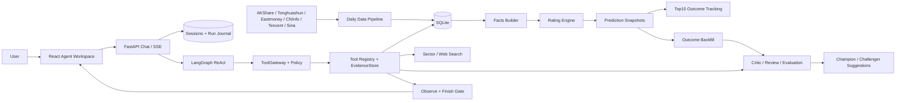
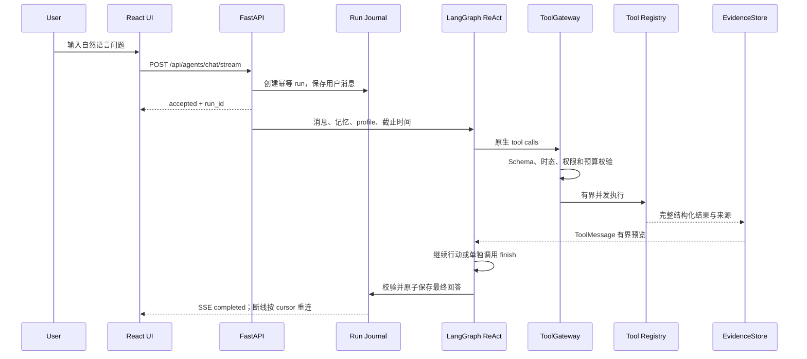

# LimitUpLab

基于真实 A 股涨停数据的可解释首板评级与复盘 Agent。

在线访问：[LimitUpLab · limitupagent.xyz](https://limitupagent.xyz/)

LimitUpLab 面向收盘后的短线研究场景：系统从当日涨停股票中筛选合格首板，构建结构化事实，生成可解释评分，并通过 LLM Agent 回答用户对市场、板块、个股和历史表现的追问。

> 本项目用于数据研究、Agent 工程实践和求职展示，不构成任何投资建议。系统不提供买入、卖出、仓位、目标价或收益承诺。

## 项目状态

当前里程碑为 **V1.4（`v1.4.0`）**，详见 [V1.4 阶段里程碑](docs/V1.4_Milestone.md)。这一版完成聊天执行链路收敛：生产入口统一为 LangChain 原生工具调用与 LangGraph 自定义 StateGraph 的有界 ReAct 循环，旧 Planner/Capability/Policy/模板执行器、Task DAG 和 Complex Graph 已退出生产调用图。

盘前推荐继续并列提供一进二接力、缩量整理和高位回撤；一进二区分收盘基线、盘前终选及历史样本，后两类形态观察不混入一进二前向统计。集合竞价和面向未涨停股票的首板挖掘仍保持退役。

历史版本：[V1.0](docs/V1_Milestone.md) 是首个首板复盘基线，[V1.1](docs/V1.1_Milestone.md) 记录集合竞价实验，[V1.2](docs/V1.2_Milestone.md) 记录工程收敛与会话记忆，[V1.3](docs/V1.3_Milestone.md) 记录盘前多策略与发布基线。历史实现由对应 Git 标签保留，现行预测与复盘口径以 [预测时间契约](docs/Prediction_Time_Contract.md) 为准。

当前版本已经具备可本地运行和单机部署的完整 MVP：

- 真实涨停、炸板、K 线、板块、人气和龙虎榜数据流水线
- 首板候选池过滤、结构化 Facts、规则评分和置信度
- 每日 Top10 推荐快照及 D+1 至 D+5 走势追踪
- LangChain 原生工具调用、LangGraph 有界 ReAct、证据引用与可恢复 SSE 任务
- 可恢复的多会话对话、滚动 Session Memory 和受控上下文
- Explanation、Critic、Review、Evaluation 等轻量 Agent 角色
- 每日 Top10 预测快照、D+1 至 D+5 走势追踪、1进2全市场对照和不可变每日复盘快照
- Champion/Challenger 评分策略注册与受约束影子优化
- 来源感知的预测质量审计、确定性基线和多目标评分 v3
- 每日连板晋级率、首板到二板率和各板高梯队统计
- 数据健康、Agent 运行轨迹、缓存和离线回归评测
- 盘前推荐页并列提供“一进二接力”“缩量整理”“高位回撤”三个入口，后两者支持固定条件筛选、历史日期查看和缺失原因解释，并独立于一进二前向统计，见 [第一版说明](docs/Consolidation_Strategy_V1.md)

当前代码基线：

| 项目 | 状态 |
| --- | --- |
| 后端自动化测试 | 统一验收入口生成当次测试数量、结果和 JUnit 报告 |
| 后端回归 | V1.4 标记前 616 项及 6 个子测试通过 |
| 本地数据健康检查 | 已实现 |
| LLM 流式问答 | 已实现 |
| Agent 限流与成本审计 | 单访客/IP/全局限制、真实 token 账本已实现 |
| 评分 v3 工程实现 | 已完成，影子验证中 |
| 单机生产部署基线 | Docker、Nginx、HTTPS、持久化卷、备份和日更任务已部署 |

评分结果目前仍处于研究和验证阶段。项目已经形成完整的数据与评价闭环，但尚未证明可以稳定预测次日表现。

## 为什么做这个项目

传统涨停看板通常只展示行情，普通股票聊天机器人则容易脱离数据泛泛而谈。LimitUpLab 尝试解决两者之间的问题：

```text
真实数据
  -> 首板候选过滤
  -> 可解释评分
  -> 不可变 Top10 预测快照
  -> LLM 工具调用问答
  -> Critic 质疑
  -> 结果回填
  -> Evaluation 复盘
  -> 评分策略改进建议
```

这个项目的核心不是让 LLM 直接预测股票，而是让 LLM 在确定性数据和工具之上完成规划、解释、追问、批判和复盘。

## 核心能力

### 1. Facts-first 首板评分

系统先构建结构化事实，再由版本化评分策略计算分数。LLM 不参与原始分数计算，因此每个结论都可以测试和回放。

候选池默认：

- 只保留收盘封住的首板股票
- 一进二接力排除 ST、北交所、科创板和创业板
- 排除新股与次新股
- 排除成交额过小样本
- 缺失字段显式写入 `data_missing` 并降低置信度

当前评分策略包含 14 类输入：首封时间、上板形态、封板稳定性、封板次数、换手率、成交额、行业热度、市场环境、涨停前 K 线结构、板块接力、市值偏好、近期股性、龙虎榜和人气快照。

每只候选都会返回：

```text
score
rating
confidence
score_breakdown
reasons
risks
data_missing
scoring_version
```

其中 `score` 表示候选强度，`confidence` 表示当前数据对该评分的支持程度，两者不会混为一谈。

### 2. Tool-Using Chat Agent

模型层由 LangChain `ChatOpenAI.bind_tools` 承接，LangGraph 自定义 `StateGraph` 在同一个有界循环中完成思考、行动、观察和最终回答。业务参数、工具权限、证据裁剪、确定性计算与最终状态仍由后端控制。当前生产 ReAct 只支持 LangChain 消息工具调用后端；Requests Provider 保留给独立文本/Judge 调用，不是聊天运行时回退。实现边界见 [LangChain + LangGraph 集成](docs/LangChain_Integration.md)。

正常问答主链路是：

```text
用户问题
  -> Durable Run 创建任务、绑定 owner/session/message_id
  -> ReAct Agent 根据当前消息和历史上下文选择一批原生工具调用
  -> ToolGateway 校验 profile、Schema、日期能力和参数边界
  -> 工具并发执行，完整结果进入 EvidenceStore，模型只接收有界预览
  -> 模型观察 ToolMessage，按需继续查询、读取/计算证据或调用 finish
  -> Answer Gate 校验状态、证据 ID、缺失项与安全边界
  -> SQLite 原子保存回答，SSE 返回进度和 completed；断线只读重连
```

当前主要工具：

| 工具 | 用途 |
| --- | --- |
| `market_summary` | 查询指定交易日市场环境 |
| `market_index_trend` | 查询上证、深成指和创业板指近 2–20 个交易日走势 |
| `dragon_tiger_list` | 查询同花顺龙虎榜、机构与游资净买额 |
| `first_board_ratings` | 查询首板评级、拆解和风险 |
| `first_board_filter` | 按行业、题材、评级和置信度筛选 |
| `market_event_pool` | 统一查询完整交易日的涨停、跌停和炸板名单或数量 |
| `limit_up_events` | 查询首板、连板、炸板及题材相关涨停事件 |
| `daily_board_promotion` | 统计近 5 日总晋级率、首板到二板率、连板梯队及成功股票明细 |
| `stock_kline` | 查询个股近期 K 线和衍生指标 |
| `stock_news` | 查询指定股票近 1 至 30 天的结构化个股资讯，保留来源、时间和链接 |
| `stock_activity` | 汇总指定股票的收盘走势、近期涨停记录、评分补充事实和个股资讯 |
| `first_board_critic` | 复核评分是否过度乐观或证据不足 |
| `rating_backtest` | 查看评分分桶历史表现 |
| `rating_evaluation` | 评价历史预测结果和错误样本 |
| `review_high_score_picks` | 追踪每日评分 Top10 后续走势，并对比同期全部首板的1进2成功率 |
| `prediction_quality_audit` | 审计预测来源、Outcome 覆盖和基线表现 |
| `scoring_policy_status` | 查询 Champion、Challenger 和晋级原因 |

生产环境不再区分 Fast Path、Complex Path 或独立 Replanner。依赖上一步名单的查询由模型在观察结果后发起下一轮工具调用；集合交并差、筛选、排序和聚合交给受限 `compute_result`，完整证据按 ID 保存在请求级 EvidenceStore，不允许模型执行任意表达式或猜测隐藏行。

默认 `LIMITUPLAB_AGENT_PROFILE=v1_close_review` 只暴露收盘后与历史研究工具；`remote_limit_up_pool` 和 `web_search` 只在 `extended` 研发 profile 开放。ToolGateway 对每一次调用重新校验 allowlist、JSON Schema、日期能力、单股票约束和空集合边界，未知或未开放工具即使由模型生成也不会执行。

旧 Query Contract 仍为部分确定性工具参数和离线兼容评测提供共享枚举/解析函数，但它不再担任生产聊天的全局语义路由器。生产执行事实以 ReAct decision、ToolMessage、EvidenceStore 和最终 trace 为准。

### 2.1 Session Memory

长对话不只依赖固定截断。系统保留 SQLite 滚动记忆，并把受预算限制的历史原始消息交给 ReAct；历史回答中的证据可以作为明确标记的 `historical_reference` 恢复，但不能自动冒充本轮行情事实。

Memory 按 `owner_id + session_id` 隔离，使用 `last_message_id` 作为增量游标，随会话永久删除。记忆只用于对话连续性，不能作为股价、新闻、评分、排名或市场状态的证据；所有时效性事实仍必须重新调用工具。当前实现是会话级 Memory，不会跨会话建立用户画像。

### 3. 轻量 Multi-Agent 角色

项目采用有边界的角色编排，不让多个 LLM 无约束地互相讨论。

| 角色 | 职责 | 是否直接使用 LLM |
| --- | --- | --- |
| Coordinator / Chat Agent | 理解问题、规划工具、组织回答 | 是 |
| Facts Builder | 从数据库构建结构化事实 | 否 |
| Rating Engine | 计算评分、评级和置信度 | 否 |
| Explanation Agent | 基于 Facts 解释评分与风险 | 是，可降级 |
| Critic Agent | 查找反向证据和数据缺口 | 结构化规则为主 |
| Review Agent | 追踪每日 Top10 后续走势及1进2全市场对照 | 可选 LLM 总结 |
| Evaluation Agent | 对历史预测分类并生成经验教训 | 结构化结果为主 |

每个角色都有结构化输入输出，可以独立测试、缓存、追踪和回放。

### 4. 自我评价与受控改进

系统每天保存不可变的评分预测快照，并在后续交易日回填：

- 次日开盘、最高、最低和收盘表现
- 是否晋级二板
- 以次日开盘为基准的收益和回撤
- 三日表现和 D+1 至 D+5 K 线

Evaluation Agent 将历史预测标记为 `success`、`partial`、`miss`、`avoid_success` 或 `false_negative`，并生成评分因子改进建议。

每日收盘 Top10 作为独立的 `close_baseline` 研究批次保存，普通日更不能覆盖。下一交易日 08:00 至 09:30 前的合法终选可以接替活动批次；原收盘快照及逐股记录先完整归档，归档、批次切换和终选写入同一事务。现行前向评价只接受 `premarket_final`，旧版收盘、收盘基线和历史补算按阶段及评分版本分别研究。`live` 兼容标签本身不代表前向资格，详见[预测时间契约](docs/Prediction_Time_Contract.md)。

Outcome 完整性检查严格按本地市场交易日对齐 D+1、D+3 和 D+5。缺少某一交易日 K 线时不会使用下一根可用 K 线替代；缺失股票会进入日更报告、数据健康和 Review 告警，并在 20 个交易日重试窗口内继续追补。

评分策略采用 Champion/Challenger 管理：

- 因子权重具有明确版本
- 训练、验证和测试按交易日期顺序执行扩展窗口 walk-forward，测试日不重叠
- 以 Top10 相对同期全部首板的一进二提升为主目标，次日收益、大跌率和三日回撤作为保护约束
- 因子相关性按交易日去中心化后计算，减少不同市场环境造成的截面偏差
- 单次权重变化受到限制
- Challenger 默认只在影子模式运行
- Challenger 必须同时优于现行策略，并接受最早封板、固定随机和 Outcome 可用候选池基线审计
- 只有至少 60 个结果日、足够的样本外折和 Top10 样本且无关键风险退化时，显式批准后才能启用

这不是无约束的“模型自动学习”。当前系统只生成和验证候选策略，不会因为一次复盘就自动修改线上规则。

`/api/agents/prediction-quality-audit` 会先按 `live / historical_backtest` 和评分版本拆分预测，再按交易日选择完整批次；未成熟、Outcome 待回填和完整样本分开统计，避免把未来尚不存在的结果算成失败，也避免把历史重算样本混入真实当日 Top10。

`/api/agents/factor-signal-diagnostic` 提供独立的快速证伪诊断：单因子按交易日计算横截面 IC，并使用日期级符号翻转检验和 Bonferroni 校正；分位比较保留同分样本；联合 Lasso 使用按交易日留一的样本外预测和日期块 bootstrap。该报告只输出“当前未发现可复现信号”或“信号需要继续验证”，不会把小样本下的未显著误写成“因子已被证明为噪声”。

`/api/agents/scoring-error-diagnostic` 从结果完整日期中识别 Top10 高分误选和 Top10 之外的晋级漏选，并对 14 个评分因子逐一做排序消融。诊断只提出“观察上调、观察下调或暂不调整”的影子假设；样本不足、Outcome 不完整或未通过 walk-forward 门槛时不会改写 Champion。

截至 2026-08-22 的本地审计中，v3 已生成 3 个测试日不重叠的样本外折，但只有 14 个 Outcome 结果日，因此仍保持影子状态。当前评分 Top10 尚未优于最早封板基线，页面会如实展示这一结论和数据覆盖缺口。

### 5. 可观测与可降级

- `agent_runs` 保存每次 Agent 执行状态、输入、输出、错误和耗时
- `agent_usage_events` 保存已接受和被拒绝的请求、真实 token、显式价格下的估算成本及耗时
- `chat_sessions`、`chat_messages` 和 `chat_session_memories` 保存会话、原始消息与滚动记忆，支持新建、恢复、重命名和永久删除
- SSE 断线后按 `run_id + event cursor` 只读重连；同一 `message_id` 可恢复中断 checkpoint，已完成工具不会主动重放
- Tool trace 保存每轮原生 decision、Policy allow/reject、工具参数、结果状态、证据引用和最终校验
- 请求级 EvidenceStore 保存完整工具结果，模型消息只携带有界预览；SQLite journal 保存运行 checkpoint 与调用结果
- `/api/agents/data-health` 检查评分、预测追踪和 Outcome 所需数据
- `/api/agents/system-health` 检查数据新鲜度、LLM、代理和 Eval 状态
- LLM 不可用或连续调用失败时返回明确 error/partial，不使用已退役的通用聊天模板伪装成功
- 工具失败时返回明确错误，不允许模型补造数字
- 匿名访客按分钟、按日限额，同一访客单并发，并设置单进程全局并发上限；超限统一返回 `429` 和 `Retry-After`

## 系统架构



### Agent 请求时序



## 技术栈

### Backend

- Python 3.13
- FastAPI + Uvicorn
- Pydantic
- SQLite
- AKShare
- Requests + BeautifulSoup
- LangChain Core + LangChain OpenAI（消息、原生工具绑定和模型适配）
- LangGraph（自定义 StateGraph ReAct 循环）
- DeepSeek 兼容 Chat Completions API

### Frontend

- React 19
- TypeScript
- Vite 6
- React Router
- React Markdown + GFM
- Lucide React

### Agent Engineering

- Native Tool-Calling ReAct
- LangGraph StateGraph
- Tool Schema + Temporal Policy Gateway
- Evidence IDs + Controlled Compute
- Durable SSE Task / Reconnect / Cancel
- Controlled Conversation Context
- Persistent Chat Sessions
- Agent Run Observability
- Deterministic + Live LLM Eval
- Champion/Challenger Policy Governance

## 项目结构

```text
LimitUpLab/
├── backend/
│   ├── app/
│   │   ├── agents/          # ReAct runtime、工具/证据契约、评分、Review 与 Eval
│   │   ├── collectors/      # 涨停、K 线、板块、指数和扩展数据采集
│   │   ├── repositories/    # SQLite Repository
│   │   ├── routers/         # FastAPI 路由
│   │   └── services/        # 评分、检索、回测、Evaluation 和健康检查
│   ├── scripts/             # 数据同步、回填、Eval 和启动脚本
│   └── tests/               # 单元测试与 Agent Eval 数据集
├── frontend/
│   └── src/                 # React 工作台、独立 Agent 会话面板、API 类型和样式
├── scripts/                 # 项目级本地启动脚本
└── docs/
    ├── V1.4_Milestone.md    # 当前版本边界、验证与遗留项
    ├── LangChain_Integration.md # 当前 ReAct 架构说明
    └── code-quality-audit.md # 阶段性代码质量审查
```

## 快速开始

### 环境要求

- Python 3.13，Windows 下不建议使用尚未完全兼容依赖的 Python 3.14
- Node.js 18+
- npm
- 能访问所配置行情源和 LLM 服务的网络环境

### 1. 安装后端

Windows PowerShell：

```powershell
cd backend
py -3.13 -m venv .venv
.\.venv\Scripts\python.exe -m pip install -r requirements.txt
Copy-Item .env.example .env
```

macOS / Linux：

```bash
cd backend
python3.13 -m venv .venv
source .venv/bin/activate
pip install -r requirements.txt
cp .env.example .env
```

### 2. 配置 LLM

编辑 `backend/.env`：

```dotenv
LIMITUPLAB_LLM_ENABLED=true
LIMITUPLAB_LLM_BASE_URL=https://api.deepseek.com
LIMITUPLAB_LLM_MODEL=deepseek-v4-flash
LIMITUPLAB_LLM_THINKING_ENABLED=false
LIMITUPLAB_LLM_NATIVE_FUNCTION_CALLING=true
DEEPSEEK_API_KEY=<your-api-key>
LIMITUPLAB_SESSION_MEMORY_ENABLED=true
LIMITUPLAB_SESSION_MEMORY_REFRESH_MESSAGES=8
```

真实 API Key 不应提交到 Git。未配置 LLM 时，结构化评分、数据检索等确定性接口仍可运行；生产聊天 ReAct 会明确报配置错误，不会伪装成正常回答。

公开运行时建议同时配置 Agent 容量。默认每访客 8 次/分钟、60 次/天、同访客 1 个并发、全站 4 个并发。管理接口 `GET /api/agents/usage?days=7` 可查看请求、拒绝、LLM 调用和 token 汇总，需要 `X-LimitUpLab-Admin-Key`。

```dotenv
LIMITUPLAB_AGENT_RATE_LIMIT_ENABLED=true
LIMITUPLAB_AGENT_REQUESTS_PER_MINUTE=8
LIMITUPLAB_AGENT_REQUESTS_PER_DAY=60
LIMITUPLAB_AGENT_IP_REQUESTS_PER_MINUTE=20
LIMITUPLAB_AGENT_MAX_CONCURRENT_PER_USER=1
LIMITUPLAB_AGENT_MAX_CONCURRENT_GLOBAL=4
```

如需记录估算金额并启用每日成本上限，再按当前模型官方价格填写每百万 token 单价。价格未配置时仍记录供应商返回的真实 token，但成本保持为 0，不会使用不可靠的字符数估算。

### 3. SQLite 单机并发配置

所有仓储统一通过数据库连接层启用 WAL、外键约束、5 秒忙等待、NORMAL 同步级别和有界锁冲突重试。Schema 使用 `PRAGMA user_version` 管理，并在 `BEGIN IMMEDIATE` 事务中只初始化一次，普通读请求不再重复执行整套 DDL 和修复写入。

```dotenv
LIMITUPLAB_SQLITE_WAL_ENABLED=true
LIMITUPLAB_SQLITE_BUSY_TIMEOUT_MS=5000
LIMITUPLAB_SQLITE_LOCK_RETRY_ATTEMPTS=3
LIMITUPLAB_SQLITE_LOCK_RETRY_BASE_DELAY_SECONDS=0.05
LIMITUPLAB_SQLITE_WAL_AUTOCHECKPOINT_PAGES=1000
```

该配置适合单机 Docker Volume。数据库繁忙超过等待与重试上限后仍会明确失败，不会无限阻塞请求；需要多实例写入时应迁移 PostgreSQL，不能通过共享 SQLite 文件替代。

如需本地代理：

```dotenv
LIMITUPLAB_PROXY_URL=http://127.0.0.1:17891
```

### 4. 配置同花顺结构化数据

项目通过官方 `hithink-finance` CLI 获取未复权个股日 K、最新行情、热股榜、龙虎榜和远端涨停池。凭据保存在 CLI 系统凭据库，不写入项目 `.env`：

```powershell
npm.cmd install -g @hithink-tech/hithink-finance-cli
hithink-finance auth login
hithink-finance symbol search --q 600519 --limit 1 --format json
```

业务读取仍以项目 SQLite 快照为先；缺少日线或当日收盘时统一经过 MarketDataProvider 调用 CLI，固定使用 `adjust=none`，并把 CLI 的“股”转换为项目统一的“手”。CLI 不可用或请求失败时，日线和收盘快照显式回退腾讯行情并保留真实来源；分钟 K 继续使用新浪、东方财富。V1 Agent 不暴露同花顺实时工具；这些工具仅在 `extended` 研发配置中用于 V2 开发，请求失败时会明确返回错误，不会伪造结果。

### 5. 安装前端

```powershell
cd frontend
npm.cmd install
```

macOS / Linux 使用：

```bash
cd frontend
npm install
```

### 6. Windows 一键启动

在项目根目录执行：

```powershell
.\scripts\start_local.cmd
```

脚本会先检查最新完整交易日和 Agent 数据健康状态；本地数据过期时会尝试执行日更，再启动前后端。

- 前端：<http://127.0.0.1:5173>
- 后端 API：<http://127.0.0.1:8001>
- Swagger：<http://127.0.0.1:8001/docs>

### 7. 手动启动

后端：

```powershell
cd backend
.\.venv\Scripts\python.exe -m uvicorn app.main:app --reload --host 127.0.0.1 --port 8001
```

前端：

```powershell
cd frontend
npm.cmd run dev -- --host 127.0.0.1 --port 5173
```

macOS / Linux 将 Python 和 npm 命令替换为对应虚拟环境命令即可。

### 8. 香港服务器 Docker 部署

仓库已提供面向单机公开 Demo 的生产部署基线：

- `backend/Dockerfile`：FastAPI、Python 数据依赖和可选同花顺 CLI
- `frontend/Dockerfile`：React 生产构建与容器内 Nginx
- `docker-compose.yml`：健康检查、自动重启、SQLite 命名卷、日更 Job 和每日 08:00 推荐固化服务
- `deploy/nginx/`：同域 API 反代、SPA 路由和 SSE 流式配置
- `.env.production.example`：不含真实密钥的生产环境模板

服务器上执行：

```bash
cp .env.production.example .env.production
docker compose --env-file .env.production build
docker compose --env-file .env.production up -d
curl --fail http://127.0.0.1:8080/health
```

完整的域名、HTTPS、定时任务、数据迁移、备份和回滚步骤见 [`deploy/README.md`](./deploy/README.md)。当前配置有意保持单个 Uvicorn worker，以匹配 SQLite 单机阶段；正式多实例并发前应迁移 PostgreSQL 和 Redis。

## 每日数据更新

正常使用应执行完整流水线，而不是只导入一张涨停表：

```powershell
cd backend
.\.venv\Scripts\python.exe scripts\update_daily_data.py --date 20260821 --replace-date
```

流水线会依次处理：

1. 导入涨停与炸板事件，并用同花顺涨停池校验数量差异。
2. 重建近期首板结构化特征。
3. 获取 K 线、上市日期、流通市值、龙虎榜和人气快照；同花顺优先，原有来源回退。
4. 对最新完整交易日生成一进二初始基线，历史补算继续标记为 `historical_backtest`。
5. 回填近期 Top10 的 D+1 至 D+5 走势。
6. 输出 JSON 数据健康报告。

盘前推荐只保留一进二接力链路，以当日全部合格首板为候选池并动态展示 Top10。流水线在
16:00 收盘数据就绪后生成一次草稿，下一交易日 08:00 再批量更新最新行情、个股新闻、龙虎榜和当前可用人气榜，并读取同花顺最新季度利润表；
财报缓存 24 小时，避免对不会频繁变化的数据重复请求。收盘基础分保持可
追溯，盘后新增公告、新上龙虎榜和可比较的人气变化以有边界的修正更新研究
分与名次；动态一进二 Top10 允许换入换出，盘前推荐与首板页前 10 名读取同
一份当前版本。系统只保存当前草稿和字段变化记录；目标
交易日 08:00 完成最后一次刷新，随后将 Top10 固化为不可变最终预测，
并以最终一进二 Top10 替换复盘基线。若服务未能在 09:30 开盘前完成固化，系统会
记录 `missed_cutoff`，停止更新排名，且不会使用开盘后行情、新闻或人气数据补算：

```powershell
cd backend
.\.venv\Scripts\python.exe scripts\run_recommendation_refresh_loop.py --once
```

本地一键启动和 Docker Compose 会自动启动每日固化进程。若进程在 08:00 至 09:30 间重启，会立即补做当日固化；09:30 后不会补算。

启动演示前也可以让系统自动判断预期交易日：

```powershell
cd backend
.\.venv\Scripts\python.exe scripts\dev_check.py --ensure-data
```

### 每日预测闭环自动化

Windows 本地环境可以安装收盘后的计划任务：

```powershell
powershell -ExecutionPolicy Bypass -File .\scripts\daily_close_loop_task.ps1 -Mode Install
```

任务默认在每个工作日 `16:00` 执行，并启用错过后补跑、失败重试和禁止并发执行。一次执行会自动完成交易日判断、原始数据同步、首板特征与 enrichment、收盘 Top10 固化、盘前研究候选更新、历史 Top10 的 D+1 至 D+5 K 线缓存、Outcome 回填、每日复盘快照和健康检查。当日收盘预测快照就绪后，任务会立即生成下一交易日的一进二草稿；独立进程在下一交易日 08:00 做唯一一次盘前更新并完成固化。

预测来源有严格时间口径：同日 15:30 后保存收盘基线并在 16:00 数据就绪后生成草稿，下一交易日 08:00 刷新并固化最终 Top10。公共写入层校验阶段、实际生成时间、信息截止和交易日历；直接脚本补算过去日期只能写入 `historical_backtest`。终选不会被普通刷新覆盖，处理跨过 09:30 开盘则回滚，错过窗口后进入 `missed_cutoff`。历史异常使用独立审计标记排除，保留原件；复盘页面可按阶段与评分版本分别查看。

Agent 将“近期涨停后回撤比较多的股票有哪些”等表述固定解释为盘前推荐的高位回撤名单查询，直接使用同一套七交易日事件窗口与确定性形态规则返回完整名单；“比较多”只描述回撤幅度，不会触发历史形态比较。

一进二动态研究排序使用明确的信息时点契约：原始规则分与截至基准交易日 `15:00` 已公开的新闻、财报共同构成收盘综合分；基础首板评分中已存在的龙虎榜和人气快照不会重复计分。动态修正只接受该时点后的新增公告、新上龙虎榜，以及相对基础快照可验证的人气名次变化；缺少人气基线时只展示最新排名并写入缺失项，不猜测涨跌。盘后各项修正合计限制在 `±6` 分，每只候选保留分项修正、动态合计和证据原因，便于回放。

手动执行、查看任务状态和卸载任务：

```powershell
cd backend
.\.venv\Scripts\python.exe scripts\run_daily_close_loop.py --trigger manual
cd ..
powershell -ExecutionPolicy Bypass -File .\scripts\daily_close_loop_task.ps1 -Mode Status
powershell -ExecutionPolicy Bypass -File .\scripts\daily_close_loop_task.ps1 -Mode Uninstall
```

每次执行都会写入 SQLite 审计记录。最新报告保存在 `backend/data/daily_close_loop_latest.json`，部分完成或失败时额外生成 `backend/data/daily_close_loop_alert.json`；前端系统状态条和 `GET /api/agents/daily-pipeline-status` 可查看最近运行结果。

## 常用 API

| 方法 | Endpoint | 说明 |
| --- | --- | --- |
| `GET` | `/api/agents/first-board-ratings` | 首板评级列表 |
| `GET` | `/api/agents/first-board-critic` | 单股 Critic 复核 |
| `GET` | `/api/agents/rating-backtest` | 评分分桶回测 |
| `GET` | `/api/agents/rating-evaluation` | Evaluation Agent 复盘 |
| `GET` | `/api/agents/review-report` | 近期 Top10 追踪报告 |
| `GET` | `/api/agents/review-snapshots` | 已固化每日复盘日期与摘要 |
| `GET` | `/api/agents/prediction-quality-audit` | 预测来源、覆盖率和基线审计 |
| `GET` | `/api/agents/factor-signal-diagnostic` | 日期阻断的因子快速证伪诊断 |
| `GET` | `/api/agents/scoring-error-diagnostic` | 高分误选、晋级漏选与逐因子消融 |
| `GET` | `/api/agents/scoring-policies` | Champion/Challenger 状态 |
| `GET` | `/api/agents/data-health` | Agent 数据健康 |
| `GET` | `/api/agents/outcome-completeness` | Top10 D+1、D+3、D+5 完整性验收 |
| `GET` | `/api/agents/system-health` | 本地系统健康 |
| `GET` | `/api/agents/daily-pipeline-status` | 每日预测闭环最近运行状态 |
| `GET` | `/api/agents/runs` | Agent 运行轨迹 |
| `POST` | `/api/agents/chat/sessions` | 创建新会话 |
| `GET` | `/api/agents/chat/sessions` | 查询可继续的会话列表 |
| `GET` | `/api/agents/chat/sessions/{session_id}` | 恢复会话消息和回答元数据 |
| `PATCH` | `/api/agents/chat/sessions/{session_id}` | 重命名会话 |
| `DELETE` | `/api/agents/chat/sessions/{session_id}` | 永久删除会话、消息和关联运行记录 |
| `POST` | `/api/agents/chat` | 同步 Agent 问答 |
| `POST` | `/api/agents/chat/stream` | SSE 流式 Agent 问答 |
| `GET` | `/api/limit-up/events` | 涨停事件查询 |
| `GET` | `/api/analysis/daily-promotion` | 每日连板晋级率与板高分层统计 |
| `GET` | `/api/stocks/{symbol}/kline` | 个股日 K 线 |
| `GET` | `/api/stocks/{symbol}/market-data` | 个股详情聚合行情、最新收盘和位置判断 |
| `GET` | `/api/stocks/{symbol}/intraday-history` | 最近 2-10 个交易日的分钟分时，默认五日一分钟周期 |

完整接口定义以 Swagger 为准。

## 测试与 Agent Eval

推荐从项目根目录运行统一离线验收。需要 Python 3.13、Node.js 24，并先安装依赖：

```powershell
backend/.venv/Scripts/python.exe -m pip install -r backend/requirements-dev.txt
npm --prefix frontend ci
backend/.venv/Scripts/python.exe scripts/check_project.py
```

Linux 使用对应虚拟环境的 `python scripts/check_project.py`。也可通过 `--scope backend` 或 `--scope frontend` 单独验收一侧。

该入口依次运行完整 pytest、Chat Eval V2 的 89-case Dev 离线回放门禁、全部前端逻辑测试以及 TypeScript/Vite 生产构建。每次使用独立数据库和测试目录，关闭真实 LLM，并在 `output/validation/<运行标识>/` 保存各步骤日志、JUnit 和 `summary.json`。任一步失败都会使整体退出码非零，但其余独立检查仍会执行。它不替代浏览器端业务验收、真实模型评测、部署检查或压力测试。

GitHub Actions 配置在 `.github/workflows/validate.yml`，对 PR、main 与 codex 分支推送运行 Windows/Linux 两套检查，使用相同验收入口，不需要行情或模型密钥。失败日志保留 7 天；测试数据库不上传。流水线文件进入远端仓库后才能实际触发，分支保护仍需在仓库设置中启用。

ReAct 执行与证据契约见 [LangChain + LangGraph 集成](docs/LangChain_Integration.md) 和 [代码阅读指南](docs/code-reading-guide.md)。以下单项命令仍可用于定位失败。

运行后端测试：

```powershell
cd backend
.\.venv\Scripts\python.exe -m pytest tests -q -p no:cacheprovider
```

运行 Chat Eval V2 的公开 Dev 契约集：

```powershell
.\.venv\Scripts\python.exe scripts\run_agent_eval.py --mode offline --summary-only
```

公开金标为 `backend/tests/fixtures/agent_chat_eval_dev_v2.json`，共 120 case；私有 40-case Holdout 通过 `LIMITUPLAB_EVAL_HOLDOUT_PATH` 注入。工具事实来自版本化 `agent_chat_eval_tool_fixture_v2.json`，不读取当前数据库或网络。原 50 题的逐题去向记录在 `agent_chat_eval_v1_migration.json`，冲突题不会直接进入 V2。完整契约见 [LimitUpLab Chat Eval V2](docs/Agent_Golden_Eval.md)。

回放报告保留七层历史契约格式，离线 Planner 为 N/A；其结果仅验证冻结夹具的契约、接地和答案检查，不代表当前 ReAct 的 Policy 执行或真实模型能力。

定向检查用例或分类：

```powershell
.\.venv\Scripts\python.exe scripts\run_agent_eval.py --case-filter CEV2-D001
.\.venv\Scripts\python.exe scripts\run_agent_eval.py --case-filter limit_up_pool
```

生产 ReAct 真实模型 + 冻结工具世界验收：

```powershell
.\.venv\Scripts\python.exe scripts\run_agent_live_eval.py --case-id LIVE-SIMPLE-002 --trials 1
.\.venv\Scripts\python.exe scripts\run_agent_live_eval.py --trials 3 --judge
```

旧 `run_agent_eval.py --mode live`（独立 Planner + Answer）已退役；`run_agent_eval.py` 只保留 offline 回放与 online-shadow。ReAct Live 报告写入 `output/agent-live-eval/`，记录原始决策、实际工具、任务终态和模型调用数。公开 Live 集不等同于私有 Holdout 发布验收，完整发布适配仍待完成，不能把旧 Planner 成绩当作 ReAct 成绩。

`online-shadow` 只读已保存的 trace，不改变用户答案；历史报告仍可读取。回放报告写入 `output/agent-eval/<run_id>/`，`GET /api/agents/eval` 只读取最近一次完成报告，系统健康最多运行 12 条冻结 smoke case。离线回放不是生产工具执行或模型质量证明。

前端生产构建：

```powershell
cd frontend
npm.cmd run build
```

## 数据源与边界

当前数据来自官方同花顺 CLI、AKShare 封装或公开接口：

- 同花顺个股日 K、最新行情、热股榜、龙虎榜和远端涨停池
- 东方财富涨停池和炸板池
- 同花顺与东方财富行业板块行情
- 腾讯日线与收盘行情回退源，Sina、东方财富分钟 K 线
- CNInfo 上市日期
- 东方财富龙虎榜和人气快照回退源
- 360 搜索、Bing 和 DuckDuckGo 的公开搜索结果回退链路

需要注意：

- 项目定位是收盘后复盘，不是实时交易终端。
- 免费公开数据源可能限流、延迟、变更字段或暂时不可用。
- 历史人气和龙虎榜时点数据无法在所有日期完整重建。
- 日 K 统一使用未复权价格；同花顺历史行情成交量由“股”标准化为“手”，来源和成交额随行持久化。
- Web 搜索内容被视为外部不可信证据，只用于解释增强，不直接决定评分。
- SQLite 适合本地 MVP，不代表正式多用户网站的最终存储方案。

## 当前限制

- 评分 v3 工程闭环已完成，但仍缺至少 60 个结果完整交易日的可靠样本外验证。
- 当前审计只有 8 个 Top10 次日 Outcome 完整日，覆盖率仍需要持续补齐。
- 当前预测准确性不高，不能宣称系统已经实现稳定选股。
- 生产 ReAct 已覆盖现有工具目录，但工具 Schema、执行签名和时态 Catalog 仍有多处定义，需要继续收敛为单一类型化契约。
- 个股资讯已接入东方财富结构化搜索并持久化缓存；正式公告原文仍需补充交易所或巨潮资讯专用数据源。
- 当前限流适用于单 Uvicorn 进程；异步 Worker、跨实例 Redis 限流和上游 LLM 主动取消尚未完成。
- 用户系统、PostgreSQL、Redis 和多实例部署尚未完成；当前 Docker 配置适用于单机公开 Demo。标签触发的自动验证、备份与部署见 [自动部署说明](deploy/Tag_Deployment.md)。

## Roadmap

近期优先级：

1. 滚动补齐 Top10 Outcome，将结果完整交易日从 14 个积累到至少 60 个。
2. 持续观察 v3 Challenger 对现行评分、最早封板和固定随机基线的样本外优势。
3. 完成 V1 Top10 不可变预测、D+1 晋级和 D+1 至 D+5 Outcome 的端到端验收。
4. 修复 ReAct 类型化终态和输出关系门禁，持续扩充工具失败、日期截止点和多轮指代评测。
5. V2 再为盘中板块、正式公告原文和更多策略建立独立数据契约与 Eval；需要横向扩容时迁移 PostgreSQL、Redis 限流和异步 Worker。

当前版本边界见 [V1.4 阶段里程碑](./docs/V1.4_Milestone.md)，后续架构工作见 [ReAct 重构计划](./docs/agent-react-refactor-plan.md)。

## 面试演示建议

一条完整演示链路约 3 至 5 分钟：

1. 展示系统健康状态和最新交易日。
2. 查看当日首板评级 Top10 和评分拆解。
3. 打开一个候选，查看封板事实、K 线、当前位置和 Critic 复核。
4. 在 Agent 中询问“为什么这只股票评分高，有哪些反向风险”。
5. 展开工具轨迹，说明 ReAct decision、Policy Gateway、Evidence ID 和最终门禁。
6. 查看过去五个交易日 Top10 的后续走势与 Evaluation 结果。
7. 展示 Champion/Challenger 未自动晋级的原因，说明系统如何避免无约束自我修改。

LimitUpLab 的重点不是功能数量，而是把数据、评分、检索、对话、自检、结果回填和受控改进连接成一条可以验证的 Agent 工程链路。
