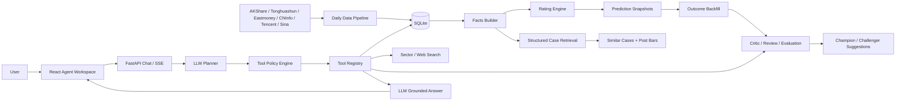
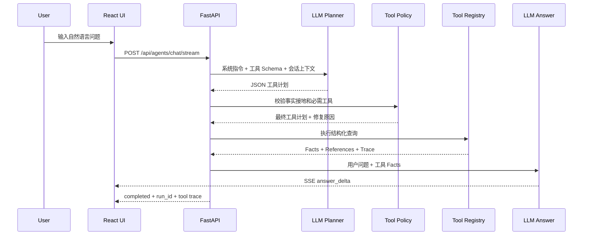

# LimitUpLab

基于真实 A 股涨停数据的可解释首板评级与复盘 Agent。

LimitUpLab 面向收盘后的短线研究场景：系统从当日涨停股票中筛选合格首板，构建结构化事实，生成可解释评分，检索历史相似案例，并通过 LLM Agent 回答用户对市场、板块、个股和历史表现的追问。

> 本项目用于数据研究、Agent 工程实践和求职展示，不构成任何投资建议。系统不提供买入、卖出、仓位、目标价或收益承诺。

## 项目状态

当前版本已经具备可本地运行的完整 MVP：

- 真实涨停、炸板、K 线、板块、人气和龙虎榜数据流水线
- 首板候选池过滤、结构化 Facts、规则评分和置信度
- 历史相似首板案例检索及后续走势缓存
- LLM Planner、工具调用、Tool Policy 修复和 SSE 流式回答
- Explanation、Critic、Review、Evaluation 等轻量 Agent 角色
- 每日 Top10 预测快照、D+1 至 D+5 走势追踪和评分复盘
- Champion/Challenger 评分策略注册与受约束影子优化
- 来源感知的预测质量审计、确定性基线和多目标评分 v3
- 数据健康、Agent 运行轨迹、缓存和离线回归评测

当前代码基线：

| 项目 | 状态 |
| --- | --- |
| 后端自动化测试 | 129 项通过 |
| 离线 Agent Eval | 11/11 通过 |
| 本地数据健康检查 | 已实现 |
| LLM 流式问答 | 已实现 |
| 评分 v3 工程实现 | 已完成，影子验证中 |
| 正式生产部署 | 尚未完成 |

评分结果目前仍处于研究和验证阶段。项目已经形成完整的数据与评价闭环，但尚未证明可以稳定预测次日表现。

## 为什么做这个项目

传统涨停看板通常只展示行情，普通股票聊天机器人则容易脱离数据泛泛而谈。LimitUpLab 尝试解决两者之间的问题：

```text
真实数据
  -> 首板候选过滤
  -> 可解释评分
  -> 历史案例检索
  -> LLM 工具调用问答
  -> Critic 质疑
  -> 结果回填
  -> Evaluation 复盘
  -> 评分策略改进建议
```

这个项目的核心不是让 LLM 直接预测股票，而是让 LLM 在确定性数据和工具之上完成规划、解释、追问、批判和复盘。

## 核心能力

### 1. Facts-first 首板评分

系统先构建结构化事实，再由版本化评分策略计算分数。LLM 不参与原始分数计算，因此每个结论都可以测试和回放。

候选池默认：

- 只保留收盘封住的首板股票
- 排除 ST、北交所和科创板
- 排除新股与次新股
- 排除成交额过小样本
- 缺失字段显式写入 `data_missing` 并降低置信度

当前评分策略包含 12 类输入：首封时间、封板稳定性、换手率、成交额、封单压力、市场环境、板块接力、涨停前 K 线结构、个股历史、流通市值、龙虎榜和人气快照。

每只候选都会返回：

```text
score
rating
confidence
score_breakdown
reasons
risks
data_missing
scoring_version
```

其中 `score` 表示候选强度，`confidence` 表示当前数据对该评分的支持程度，两者不会混为一谈。

### 2. 结构化历史案例 RAG

本项目最主要的 RAG 数据不是新闻文本，而是自己的历史首板案例库。

检索采用两阶段流程：

1. SQLite 根据日期、首板状态、封板时间区间和封板质量召回约 300 至 500 条候选。
2. Python 根据封板时间、稳定性、换手、成交额、市场环境、行业热度和 K 线结构做加权精排。

最终返回 Top-K 案例，并说明：

- 为什么相似
- 哪些地方不同
- 案例首板后的 D+1 至 D+5 走势
- 数据是否完整

这种设计比直接使用向量数据库更适合结构化行情数据，也更容易解释相似度来源。

### 3. Tool-Using Chat Agent

正常问答主链路是：

```text
用户问题
  -> LLM Planner 生成 JSON 工具计划
  -> Tool Policy Engine 检查事实接地要求
  -> 后端执行结构化工具
  -> LLM 只基于工具 Facts 生成回答
  -> SSE 流式返回文本和执行轨迹
```

当前主要工具：

| 工具 | 用途 |
| --- | --- |
| `market_summary` | 查询指定交易日市场环境 |
| `sector_performance` | 查询行业板块表现、排名、资金和趋势 |
| `hot_stock_ranking` | 查询同花顺热股榜、热度和排名变化 |
| `dragon_tiger_list` | 查询同花顺龙虎榜、机构与游资净买额 |
| `remote_limit_up_pool` | 查询并筛选同花顺远端涨停池 |
| `first_board_ratings` | 查询首板评级、拆解和风险 |
| `first_board_filter` | 按行业、题材、评级和置信度筛选 |
| `limit_up_events` | 查询首板、连板、炸板及题材相关涨停事件 |
| `first_board_similar_cases` | 检索历史相似首板案例 |
| `stock_kline` | 查询个股近期 K 线和衍生指标 |
| `first_board_critic` | 复核评分是否过度乐观或证据不足 |
| `rating_backtest` | 查看评分分桶历史表现 |
| `rating_evaluation` | 评价历史预测结果和错误样本 |
| `review_high_score_picks` | 追踪近期每日高分 Top10 后续走势 |
| `prediction_quality_audit` | 审计预测来源、Outcome 覆盖和基线表现 |
| `scoring_policy_status` | 查询 Champion、Challenger 和晋级原因 |
| `web_search` | 按需检索新闻、公告、政策和公开背景信息 |

Tool Policy Engine 会修复 Planner 漏调工具的情况。例如，用户询问某只股票走势时必须调用 K 线工具，询问当天涨停时必须查询本地涨停事件，不能让模型直接凭记忆作答。

### 4. 轻量 Multi-Agent 角色

项目采用有边界的角色编排，不让多个 LLM 无约束地互相讨论。

| 角色 | 职责 | 是否直接使用 LLM |
| --- | --- | --- |
| Coordinator / Chat Agent | 理解问题、规划工具、组织回答 | 是 |
| Facts Builder | 从数据库构建结构化事实 | 否 |
| Rating Engine | 计算评分、评级和置信度 | 否 |
| Retrieval Agent | 检索并解释相似历史案例 | 主要为确定性逻辑 |
| Explanation Agent | 基于 Facts 解释评分与风险 | 是，可降级 |
| Critic Agent | 查找反向证据和数据缺口 | 结构化规则为主 |
| Review Agent | 追踪每日 Top10 后续走势 | 可选 LLM 总结 |
| Evaluation Agent | 对历史预测分类并生成经验教训 | 结构化结果为主 |

每个角色都有结构化输入输出，可以独立测试、缓存、追踪和回放。

### 5. 自我评价与受控改进

系统每天保存不可变的评分预测快照，并在后续交易日回填：

- 次日开盘、最高、最低和收盘表现
- 是否晋级二板
- 以次日开盘为基准的收益和回撤
- 三日表现和 D+1 至 D+5 K 线

Evaluation Agent 将历史预测标记为 `success`、`partial`、`miss`、`avoid_success` 或 `false_negative`，并生成评分因子改进建议。

评分策略采用 Champion/Challenger 管理：

- 因子权重具有明确版本
- 训练、验证和测试按交易日期顺序执行扩展窗口 walk-forward，测试日不重叠
- 同时优化次日开盘到收盘收益、晋级二板概率和大跌风险保护
- 因子相关性按交易日去中心化后计算，减少不同市场环境造成的截面偏差
- 单次权重变化受到限制
- Challenger 默认只在影子模式运行
- Challenger 必须同时优于现行策略，并接受最早封板、固定随机和 Outcome 可用候选池基线审计
- 只有至少 60 个结果日、足够的样本外折和 Top10 样本且无关键风险退化时，显式批准后才能启用

这不是无约束的“模型自动学习”。当前系统只生成和验证候选策略，不会因为一次复盘就自动修改线上规则。

`/api/agents/prediction-quality-audit` 会先按 `live / historical_backtest` 和评分版本拆分预测，再对同一股票同一交易日去重；未成熟、Outcome 待回填和完整样本分开统计，避免把未来尚不存在的结果算成失败，也避免把历史重算样本伪装成真实当日预测。

截至 2026-08-22 的本地审计中，v3 已生成 3 个测试日不重叠的样本外折，但只有 14 个 Outcome 结果日，因此仍保持影子状态。当前评分 Top10 尚未优于最早封板基线，页面会如实展示这一结论和数据覆盖缺口。

### 6. 可观测与可降级

- `agent_runs` 保存每次 Agent 执行状态、输入、输出、错误和耗时
- Tool trace 展示 Planner 原始计划、后端修复原因、工具参数和结果摘要
- SQLite Agent Cache 缓存低风险结构化结果
- `/api/agents/data-health` 检查评分和历史案例所需数据
- `/api/agents/system-health` 检查数据新鲜度、LLM、代理和 Eval 状态
- LLM 不可用时回退到基于相同 Facts 的模板答案
- 工具失败时返回明确错误，不允许模型补造数字

## 系统架构



### Agent 请求时序



## 技术栈

### Backend

- Python 3.13
- FastAPI + Uvicorn
- Pydantic
- SQLite
- AKShare
- Requests + BeautifulSoup
- DeepSeek 兼容 Chat Completions API

### Frontend

- React 19
- TypeScript
- Vite 6
- React Router
- React Markdown + GFM
- Lucide React

### Agent Engineering

- LLM Tool Planner
- 声明式 Tool Schema
- Tool Policy Repair
- Facts Grounding
- SSE Streaming
- Controlled Conversation Context
- Agent Run Observability
- Deterministic + Live LLM Eval
- Champion/Challenger Policy Governance

## 项目结构

```text
LimitUpLab/
├── backend/
│   ├── app/
│   │   ├── agents/          # Chat、Explanation、Review、Eval 和 Tool Policy
│   │   ├── collectors/      # 涨停、K 线、板块、指数和扩展数据采集
│   │   ├── repositories/    # SQLite Repository
│   │   ├── routers/         # FastAPI 路由
│   │   └── services/        # 评分、检索、回测、Evaluation 和健康检查
│   ├── scripts/             # 数据同步、回填、Eval 和启动脚本
│   └── tests/               # 单元测试与 Agent Eval 数据集
├── frontend/
│   └── src/                 # React 工作台、API 类型和样式
├── scripts/                 # 项目级本地启动脚本
├── Tasks.md                 # 开发路线图和进度
└── 需求.md                  # 完整产品与 Agent 需求
```

## 快速开始

### 环境要求

- Python 3.13，Windows 下不建议使用尚未完全兼容依赖的 Python 3.14
- Node.js 18+
- npm
- 能访问所配置行情源和 LLM 服务的网络环境

### 1. 安装后端

Windows PowerShell：

```powershell
cd backend
py -3.13 -m venv .venv
.\.venv\Scripts\python.exe -m pip install -r requirements.txt
Copy-Item .env.example .env
```

macOS / Linux：

```bash
cd backend
python3.13 -m venv .venv
source .venv/bin/activate
pip install -r requirements.txt
cp .env.example .env
```

### 2. 配置 LLM

编辑 `backend/.env`：

```dotenv
LIMITUPLAB_LLM_ENABLED=true
LIMITUPLAB_LLM_BASE_URL=https://api.deepseek.com
LIMITUPLAB_LLM_MODEL=deepseek-v4-flash
LIMITUPLAB_LLM_THINKING_ENABLED=false
DEEPSEEK_API_KEY=<your-api-key>
```

真实 API Key 不应提交到 Git。未配置 LLM 时，结构化评分、检索和模板回答仍然可以运行。

如需本地代理：

```dotenv
LIMITUPLAB_PROXY_URL=http://127.0.0.1:17891
```

### 3. 配置同花顺结构化数据

项目通过官方 `hithink-finance` CLI 获取热股榜、龙虎榜和远端涨停池。凭据保存在 CLI 系统凭据库，不写入项目 `.env`：

```powershell
npm.cmd install -g @hithink-tech/hithink-finance-cli
hithink-finance auth login
hithink-finance symbol search --q 600519 --limit 1 --format json
```

CLI 不可用或请求失败时，每日 enrichment 会回退到原有 AkShare/东方财富来源；Agent 的同花顺实时工具会明确返回失败，不会伪造结果。

### 4. 安装前端

```powershell
cd frontend
npm.cmd install
```

macOS / Linux 使用：

```bash
cd frontend
npm install
```

### 5. Windows 一键启动

在项目根目录执行：

```powershell
.\scripts\start_local.cmd
```

脚本会先检查最新完整交易日和 Agent 数据健康状态；本地数据过期时会尝试执行日更，再启动前后端。

- 前端：<http://127.0.0.1:5173>
- 后端 API：<http://127.0.0.1:8001>
- Swagger：<http://127.0.0.1:8001/docs>

### 6. 手动启动

后端：

```powershell
cd backend
.\.venv\Scripts\python.exe -m uvicorn app.main:app --reload --host 127.0.0.1 --port 8001
```

前端：

```powershell
cd frontend
npm.cmd run dev -- --host 127.0.0.1 --port 5173
```

macOS / Linux 将 Python 和 npm 命令替换为对应虚拟环境命令即可。

## 每日数据更新

正常使用应执行完整流水线，而不是只导入一张涨停表：

```powershell
cd backend
.\.venv\Scripts\python.exe scripts\update_daily_data.py --date 20260821 --replace-date
```

流水线会依次处理：

1. 导入涨停与炸板事件，并用同花顺涨停池校验数量差异。
2. 重建近期首板结构化特征。
3. 获取 K 线、上市日期、流通市值、龙虎榜和人气快照；同花顺优先，原有来源回退。
4. 保存当日 Top10 不可变预测快照。
5. 回填近期 Top10 的 D+1 至 D+5 走势。
6. 回填相似案例后续 K 线和历史结果。
7. 输出 JSON 数据健康报告。

启动演示前也可以让系统自动判断预期交易日：

```powershell
cd backend
.\.venv\Scripts\python.exe scripts\dev_check.py --ensure-data
```

### 每日预测闭环自动化

Windows 本地环境可以安装收盘后的计划任务：

```powershell
powershell -ExecutionPolicy Bypass -File .\scripts\daily_close_loop_task.ps1 -Mode Install
```

任务默认在每个工作日 `16:10` 执行，并启用错过后补跑、失败重试和禁止并发执行。一次执行会自动完成交易日判断、原始数据同步、首板特征与 enrichment、当日 Top10 预测快照、最近 Top10 的 D+1 至 D+5 K 线缓存、Outcome 回填和健康检查。

预测来源有严格时间口径：只有交易日当天 `15:30` 后成功生成的预测会标记为 `live`；次日或更晚补算的数据只能标记为 `historical_backtest`，不能进入真实预测准确率统计。

手动执行、查看任务状态和卸载任务：

```powershell
cd backend
.\.venv\Scripts\python.exe scripts\run_daily_close_loop.py --trigger manual
cd ..
powershell -ExecutionPolicy Bypass -File .\scripts\daily_close_loop_task.ps1 -Mode Status
powershell -ExecutionPolicy Bypass -File .\scripts\daily_close_loop_task.ps1 -Mode Uninstall
```

每次执行都会写入 SQLite 审计记录。最新报告保存在 `backend/data/daily_close_loop_latest.json`，部分完成或失败时额外生成 `backend/data/daily_close_loop_alert.json`；前端系统状态条和 `GET /api/agents/daily-pipeline-status` 可查看最近运行结果。

## 常用 API

| 方法 | Endpoint | 说明 |
| --- | --- | --- |
| `GET` | `/api/agents/first-board-ratings` | 首板评级列表 |
| `GET` | `/api/agents/first-board-similar-cases` | 历史相似案例 |
| `GET` | `/api/agents/first-board-critic` | 单股 Critic 复核 |
| `GET` | `/api/agents/rating-backtest` | 评分分桶回测 |
| `GET` | `/api/agents/rating-evaluation` | Evaluation Agent 复盘 |
| `GET` | `/api/agents/review-report` | 近期 Top10 追踪报告 |
| `GET` | `/api/agents/prediction-quality-audit` | 预测来源、覆盖率和基线审计 |
| `GET` | `/api/agents/scoring-policies` | Champion/Challenger 状态 |
| `GET` | `/api/agents/data-health` | Agent 数据健康 |
| `GET` | `/api/agents/system-health` | 本地系统健康 |
| `GET` | `/api/agents/daily-pipeline-status` | 每日预测闭环最近运行状态 |
| `GET` | `/api/agents/runs` | Agent 运行轨迹 |
| `POST` | `/api/agents/chat` | 同步 Agent 问答 |
| `POST` | `/api/agents/chat/stream` | SSE 流式 Agent 问答 |
| `GET` | `/api/limit-up/events` | 涨停事件查询 |
| `GET` | `/api/stocks/{symbol}/kline` | 个股日 K 线 |

完整接口定义以 Swagger 为准。

## 测试与 Agent Eval

运行后端测试：

```powershell
cd backend
.\.venv\Scripts\python.exe -m pytest tests -q -p no:cacheprovider
```

运行确定性 Agent 回归：

```powershell
.\.venv\Scripts\python.exe scripts\run_agent_eval.py
```

运行真实 LLM Planner 抽样评测：

```powershell
.\.venv\Scripts\python.exe scripts\run_agent_eval.py --mode live-llm --summary-only
```

`live-llm` 默认对每个 case 运行 3 次，只让真实模型负责 Planner，并用确定性模板检查工具事实，从而把“工具选择波动”和“自然语言表达波动”分开。报告会单独给出 LLM 覆盖率、Planner 工具准确率、后端修复率、case 通过率和不稳定 case 数；真实 Planner 未被调用时会直接判失败，不能再由模板兜底形成假通过。

需要抽查完整端到端回答时执行：

```powershell
.\.venv\Scripts\python.exe scripts\run_agent_eval.py --mode live-llm --trials 1 --live-answer
```

CI 或发布前可以组合 `--fail-on-failures --fail-on-unstable` 使用严格门禁。Windows CLI 会读取 User/Machine 环境中的 API Key，并自动排除已知失效代理；LLM 对超时、连接失败、限流和服务端错误进行有限指数退避重试。

Eval 会检查：

- 意图和日期解析
- 必需与禁止调用的工具
- Tool Policy 是否发生后端修复
- 回答是否包含关键事实
- 投资建议安全边界
- 工具调用失败和数据缺失时的表达
- 多次采样下的 Planner 一致性和真实 LLM 覆盖率

前端生产构建：

```powershell
cd frontend
npm.cmd run build
```

## 数据源与边界

当前数据来自官方同花顺 CLI、AKShare 封装或公开接口：

- 同花顺热股榜、龙虎榜和远端涨停池
- 东方财富涨停池和炸板池
- 同花顺与东方财富行业板块行情
- 腾讯、Sina、东方财富历史与分钟 K 线
- CNInfo 上市日期
- 东方财富龙虎榜和人气快照回退源
- 360 搜索、Bing 和 DuckDuckGo 的公开搜索结果回退链路

需要注意：

- 项目定位是收盘后复盘，不是实时交易终端。
- 免费公开数据源可能限流、延迟、变更字段或暂时不可用。
- 历史人气和龙虎榜时点数据无法在所有日期完整重建。
- Web 搜索内容被视为外部不可信证据，只用于解释增强，不直接决定评分。
- SQLite 适合本地 MVP，不代表正式多用户网站的最终存储方案。

## 当前限制

- 评分 v3 工程闭环已完成，但仍缺至少 60 个结果完整交易日的可靠样本外验证。
- 当前审计只有 8 个 Top10 次日 Outcome 完整日，覆盖率仍需要持续补齐。
- 当前预测准确性不高，不能宣称系统已经实现稳定选股。
- 真实 LLM 的自由问法和工具选择还需要更大规模 Eval。
- 公告检索目前主要依赖通用搜索，尚未接入完整的结构化公告数据源。
- 异步 Worker、用户级并发限制、成本配额和取消机制尚未完成。
- 用户系统、PostgreSQL、Docker、CI/CD 和正式部署配置尚未完成。

## Roadmap

近期优先级：

1. 滚动补齐 Top10 Outcome，将结果完整交易日从 14 个积累到至少 60 个。
2. 持续观察 v3 Challenger 对现行评分、最早封板和固定随机基线的样本外优势。
3. 扩展真实 LLM Eval，覆盖更多自由问法、工具失败和多轮指代。
4. 接入结构化公告源并增强引用质量。
5. 完成并发、异步 Worker、限流和生产部署能力。

详细进度见 [Tasks.md](./Tasks.md)，完整需求见 [需求.md](./%E9%9C%80%E6%B1%82.md)。

## 面试演示建议

一条完整演示链路约 3 至 5 分钟：

1. 展示系统健康状态和最新交易日。
2. 查看当日首板评级 Top10 和评分拆解。
3. 打开一个候选，查看封板事实、K 线和历史相似案例。
4. 在 Agent 中询问“为什么这只股票评分高，有哪些反向风险”。
5. 展开工具轨迹，说明 LLM Planner、Tool Policy 和 Facts Grounding。
6. 查看过去五个交易日 Top10 的后续走势与 Evaluation 结果。
7. 展示 Champion/Challenger 未自动晋级的原因，说明系统如何避免无约束自我修改。

LimitUpLab 的重点不是功能数量，而是把数据、评分、检索、对话、自检、结果回填和受控改进连接成一条可以验证的 Agent 工程链路。
