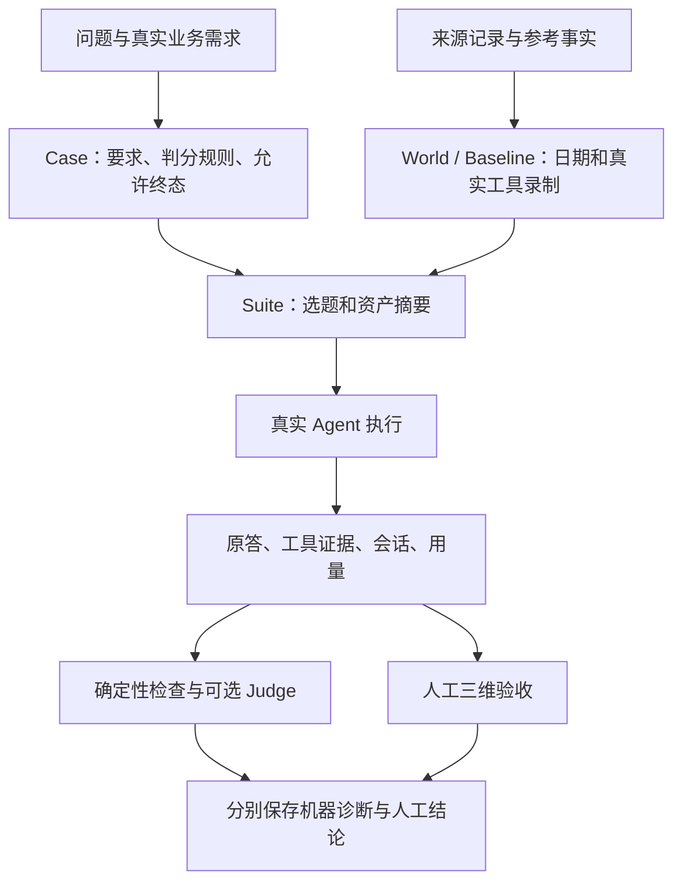

# 评测集导航与后续计划

核查日期：2026-09-23。本文负责解释结构、定位文件和安排后续工作；当前批次的详细证据继续维护在[真实 Golden 建设清单](Agent_Evaluation_Real_Golden.md)。历史运行与审核原件保留原路径、原内容。

## 1. 先看这几个入口

| 想了解什么 | 入口 | 怎么读 |
| --- | --- | --- |
| 当前到底有哪些题 | [30题设计](../backend/evals/suites/real-dev30-design.json) | 问题、真实业务需求、能力、判分口径；26单轮＋4两轮 |
| 哪些题已经可运行 | [28题准入索引](../backend/evals/suites/real-dev28-active-index.json) | 当前 Active Dev 身份、版本摘要和本地 suite 路径 |
| Agent 实际答得如何 | [答案验收](../output/agent-eval/real-golden-admission-20260923-001/ANSWER_REVIEW_RESULT.md) | 20通过、8不通过；原答和原因见同目录 ANSWER_REVIEW_BATCH.md |
| 同一问题是否稳定 | [10题三次稳定性](../output/agent-eval/real-golden-admission-20260923-001/STABILITY_RESULT.md) | 4题3/3、2题2/3、4题0/3 |
| 自动裁判是否可信 | [Judge人审对照](../output/agent-eval/real-dev28-judge-calibration-20260923-001/REPORT.md) | 23份答案中22份完成，漏判5份人审失败中的4份 |
| 当前限制及详细来源 | [真实 Golden 建设清单](Agent_Evaluation_Real_Golden.md) | 当前批次详细记录；最新进度在这里集中维护 |

链接到 `output/` 的文件只在保留本地评测资产的机器上可用。Git 中的索引和标签不能单独重现运行。

## 2. 项目里三种“评测”要分开理解

| 工作 | 回答的问题 | 入口 | 结果用途 |
| --- | --- | --- | --- |
| 工程测试 | 参数、计算、工具、会话和界面代码是否正常 | `backend/tests/`、前端测试、`scripts/check_project.py` | 无密钥确定性回归；合成 fixture 可用于技术测试 |
| Chat Agent 问答评测 | 是否理解真实研究问题，正确取证、计算、解释和追问 | `backend/app/agent_eval/`、`backend/evals/`、`output/agent-eval/` | 本文的 Dev28，使用真实模型和来源可追溯的数据 |
| 首板预测效果复盘 | 保存的评分/预测与后续 Outcome 有何关系 | `backend/app/services/evaluation_agent.py`、预测质量审计与 Champion/Challenger | 数据完整性、成熟样本和历史预测分析；不能用问答通过率代替 |

问答评测可以检查 Agent 是否如实解释预测结果，但它本身不证明评分具有预测价值。三者应分别报告。

## 3. 当前题库的设计

### 3.1 当前基线

- 30题的题意、需求与判分口径已获认可；其中28题 Active，24单轮＋4两轮。
- Q09/Q23是有真实参考资料的历史新闻需求，受执行能力限制暂缓；不把它们计入可运行28题。
- 当前28题都是公开 Dev，可用于诊断。Private Holdout 尚未建立。
- 真实回答基线绑定 `react-runtime-v24`、`agent-tools-v2`、`react-evidence-v4` 及提示摘要。
- 28份有效回答人工验收20通过、8不通过（71.4%）。M03曾补录夹具，故这个汇总不能称为全套首次运行 pass@1。
- 10题有同版三次运行的人审结论；另外18题没有三次稳定性结论。
- Judge对照完成样本一致18/22（81.8%），但失败识别仅1/5；当前继续以人工标签为答案验收依据。

这些是已保存的历史版本结果；修改 Agent、工具、数据或提示后，需要另记新版本结果。

### 3.2 题目围绕哪些业务

| 业务方向 | 题号 | 核心考点 |
| --- | --- | --- |
| 涨停复盘、名单与状态 | Q01/02/03/08/10 | 收盘封板与盘中开板口径、排名/筛选顺序、完整名单和输出约束 |
| 跨日追踪与结构统计 | Q04/14/15/16/21 | 首板队列、晋级/未回封交集、行业分组、指标分母和同口径比较 |
| 日内特征与动态定位 | Q17/18/19/20/22 | 首次/最后封板时间、开板次数、动态选股对象、市场板块过滤 |
| 价格与区间计算 | Q05/06/07 | 先定位对象再查价、日期窗口、基期、价格来源及可比性 |
| 保存的预测与评级解释 | Q11/12/13 | 原始快照、评分版本/阶段、理由、生成时间与数据截止日 |
| 连续两轮会话 | M01/02/03/04 | 实体、结果集、歧义代词和改日期；每题是整段会话 |
| 安全与消歧 | Q24/25/26 | 交易请求边界、保留可回答事实、不唯一简称先确认 |
| 历史新闻与真实缺口（暂缓） | Q09/23 | 来源与历史时点、本地未收录不等于全网无新闻、不用旧闻编造因果 |

来源标注为“根据真实业务需求整理”，不能称为30条真实用户原话。题目失败仍然保留在 Active，题库不能只留下 Agent 已经答对的问题。

### 3.3 一道题为什么会对应很多文件

| 文件/概念 | 作用 | 不要混淆 |
| --- | --- | --- |
| `real-dev30-design.json` | 面向人的题目设计清单 | 不含运行所需全部证据 |
| `case.json` | 用户请求、要求、断言、允许终态、版本 | `active`表示准入，不能表示答对 |
| `reference.json` | 来源、业务解释、参考事实和裁决依据 | 历史候选文件的 pending 字段可能保持原样；后续认可看绑定记录 |
| `world.json` / `baseline.json` | 时间锚点、日历边界、真实工具输出 | Offline用于回放；Historical Live用于执行前核对数据 |
| `suite.json` | 题目路径、世界/基线摘要、数据库路由 | 当前可运行清单，以此识别题目版本 |
| `response.json`及逐轮文件 | Agent真实回答、证据和会话上下文 | `complete`只表示运行终态，不表示质量通过 |
| `manifest`、`summary`、`result`、`report` | 版本、预算、用量、诊断与聚合 | `needs_review`是未完成裁决，不是失败或通过 |
| approval / answer labels | 认可对象、人工标签、对应摘要 | 题目认可与答案认可分别绑定；原机器报告不被改写 |

实现类型见 [models.py](../backend/app/agent_eval/models.py)，调度见 [golden_run.py](../backend/app/agent_eval/golden_run.py)，真实执行见 [worker.py](../backend/app/agent_eval/worker.py)。普通使用不必逐个打开这些实现文件。

### 3.4 实际存在三条执行路径

| 当前题数 | 路径 | 实际行为 | 边界 |
| ---: | --- | --- | --- |
| 7 | Offline / Frozen Registry | 真实LLM决定工具调用，匹配已录制参数并回放真实输出 | 合理但未录制的参数会导致夹具失败；不能算Agent答错 |
| 14 | HistoricalLiveRegistry | 在固定历史数据上执行受限的真实生产工具 | 适合事件筛选、统计等可变参数；不是外部实时接口测试 |
| 7 | SnapshotLiveRegistry | 只读复制源SQLite，再在每次运行的隔离副本上执行生产工具 | 属于Historical Live，覆盖本地价格与预测快照；会产生数据库副本 |

Suite的模式统计为 **7 Offline＋21 Historical Live**；后者再细分14＋7，不能加成35题。4道两轮题复用真实首轮会话，整段算1题；会话继承成功也不等于回答正确。

未来维护本地确定性数据题时，优先评估现有Historical Live能力，减少逐条补参数录制的成本；已有Offline基线先保留，不能无记录迁移并混算历史成绩。

### 3.5 现在如何判分

1. 确定性检查负责已实现的工具、参数、集合、计算、证据、终态等规则；覆盖不到的语义保留待复核。
2. 人工按 `task_completion`（是否交付）、`grounding`（证据是否支持）、`boundary_safety`（是否守住边界）逐维判定。
3. Judge读取已保存回答和证据做辅助诊断；当前双轮语义裁判未启用，长证据也存在输入预算限制。
4. 夹具缺口、数据漂移、模型服务错误、裁判故障单列为不可评分；不能悄悄排除后只报一个通过率。

当前机器汇总仍是27个 `needs_review`、1个Q26确定性 `fail`；人工结论另为20过、8不过，两层记录用途不同。`release_eligible=false`不妨碍Dev用于学习和定位问题，也不代表可以宣称发布质量已通过。

## 4. 本地文件怎么找、怎么保留

本次实际盘点：`output/agent-eval/`有79个一级目录、26,314个文件，共约12.09 GiB；其中70个 `.sqlite`约8.31 GiB，JSON约3.78 GiB。大量空间来自运行/预检副本和完整工具证据，不是有两万多道题。统计是本次核查时点的文件大小总和，不是磁盘分配空间。

### 4.1 当前必须能找到的资产

以下路径均相对 `output/agent-eval/`：

| 路径 | 当前用途 |
| --- | --- |
| `real-golden-admission-20260923-001/active-dev28-final/suite.json` | 唯一当前Active执行清单，Case和Baseline在其目录下 |
| `real-golden-admission-20260923-001/` | 当前准入、28份答案、人审、运行汇总；中间19/28题清单保留过程证据 |
| `real-golden-build-20260922-001/bundle/` | 原题目参考事实、来源与题目审核原件 |
| `real-golden-bindings-20260923-001/` | 补充真实执行绑定、混合价格录制，以及7题依赖的数据库 |
| `q01-historical-20260922-001/events-and-bars.sqlite` | 当前14题直接引用的历史事件源快照；目录名字虽旧，仍是活动依赖 |
| `real-golden-bindings-20260923-001/bundle/source-snapshot.sqlite` | 当前7题Snapshot Live直接引用的源快照 |
| `real-dev28-stability-trial2-20260923-001/`、`real-dev28-stability-trial3-20260923-001/` | 10题的第二/第三次原答和报告；第一次来自当前28题验收 |
| `real-dev28-judge-calibration-20260923-001/` | 23份已保存答案的Judge复评与人审比较 |
| `real-golden-dev28-preflight-20260923-001/`及对应 `preflight-diagnostic` 目录 | 统一预检阻断和后续只读核对证据 |

Git中常用文件只有设计、准入索引、人审标签和稳定性标签四份JSON；数据库、真实原答与生成报告继续留在本地忽略目录。

### 4.2 其他文件属于什么历史

| 历史资产 | 如何理解 |
| --- | --- |
| `blueprints/core40_live48.json`、`plans/` | 早期选题蓝图，不能按蓝图数量算成已运行题库 |
| `suites/local30.json`、`datasets/`、早期 `runs/` / `reviews/` | Local30构建、执行和复核；与当前真实Dev28不累加题数 |
| `basic70-*`、`golden/basic64-current-v1/`、`golden64-*` | Basic70扩建、Golden64合同准入及各版预检；含旧标准资产和历史阻断 |
| `dev10-*`、`real-dev6-*`、`q01-*`、`m02-*`、`m04-*` | 选题纠正、运行时修复和两轮能力建设过程；部分仍被当前审批/源数据引用 |
| `acceptance/`、`formal/`、`trace-*`、`preflight/` | 各时期的验收、诊断、裁判与预检产物，不是新的独立题库 |

这是用途分类，不是可删除清单。不能仅凭日期或名字删除目录；当前Suite、审核绑定和历史报告使用了跨目录乃至绝对路径。

### 4.3 后续整理方式

- 日常只维护本页导航和[当前建设清单](Agent_Evaluation_Real_Golden.md)；[Status](Agent_Evaluation_Status.md)作为历史时间线，旧Priority作为历史计划。新进度集中更新建设清单。
- 新运行使用一致的名称和一个明确的套件入口；报表链接现有原件，避免再复制一套答案/录制来做人工审核。
- 下一阶段先列出活动Suite、人工标签、稳定性标签、审批原件和源数据库的完整依赖，再制作可恢复的本地备份。源数据库和历史原答不进Git。
- 冷存储应记录文件清单、摘要和恢复路径并验证可读性；只在确认无活动引用且备份可恢复后另行决定清理副本。本次不搬移、不删除历史资产。
- 新机器复现需要本地数据包及路径解析方案。当前Git索引只是导航；暂不新增通用资产管理框架。

## 5. 已知问题与修复优先级

以下整理自已认可的真实回答与源码，列的是下一阶段候选工作，本次没有修改Agent、工具或Judge。

| 优先级 | 问题 | 证据 | 后续验收重点 |
| --- | --- | --- | --- |
| P0 | 统一预检与worker能力开关不一致 | `golden_run.validate_live_baseline`未传`allow_limit_down`，worker会传；14题预检误报不可评分 | 独立修复阶段只修共享参数传递；零模型预检对28题逐项核对，真实缺口仍保留失败 |
| P0 | 价格窗口/基期和不同来源可比性 | Q05、M01；M01三次均不过 | 计算输入明确来源、复权口径、起止日；无法核验可比性时如实披露，不制造精确收益数 |
| P0 | 评分阶段、版本和预测时点解释失真 | Q11/Q12/Q13；Q11三次均不过 | 保存快照、当前评分、`close_baseline`、`live`标签、created_at/data_as_of区分准确 |
| P1 | 澄清行为与终态不一致 | Q26三次均不过；M03三次均未妥善处理代词歧义 | 真实不唯一对象先澄清，正文和结构化终态一致，唯一指代的正常追问仍可继续 |
| P1 | 超范围补充或无证据推断 | Q01资金偏好推断；Q02第三次违反“只列代码名称” | 核心事实正确之外，还核对额外陈述的证据与输出限制 |
| P2 | Judge漏判、协议错误和证据预算 | 人审失败漏判4/5，另1份调用错误 | 独立Judge改进阶段用固定真实标注对照，关注false pass和弃判；不以整体一致率替代失败识别 |
| 暂缓 | 历史新闻与跨时点刷新 | Q09/Q23；M05未入本包 | 先有可信历史时间/数据边界，再恢复选题执行；不替换成另一需求凑数量 |

Q23还有标注措辞待核验：设计/rubric写“有真实收盘和涨跌字段”，原参考记录的 `change_pct` 为null。恢复该题时应明确字段存在与数值可用的区别；本次保留原题和原参考，不重写已批准合同或编造值。

## 6. 结合项目目标的后续顺序

### 阶段一：固定当前基线和复现入口

保留Dev28及已有人工标签，完成上述预检参数问题的独立修复，再补最小依赖清单与恢复说明。结束条件是能从同一个套件定位28题、数据和原始成绩，预检能区分真实数据异常与执行器配置错误。先不增加题目数量，也不要求所有题答对。

### 阶段二：独立修复已有真实失败

按价格可比性、预测来源解释、消歧、额外陈述四组处理；修改Agent必须由用户在独立修复阶段明确要求。每组先定位是数据契约、工具元信息、上下文还是回答逻辑问题，再做通用修复，避免给某题加提示特例。修复后记录badCase，并运行受影响工程测试及相关真实Dev题；原题、真值、人审失败原件不变。

修复阶段结束时，对固定版本跑一次完整Dev28；对风险较高或本次变化涉及的关键题预先固定三次独立运行。既有10题三次结果作为比较基线，不为每个文案改动重复全量模型评测，不重跑挑最好答案。输出分题变化、未解决问题、不可评分数量和用量。

### 阶段三：从真实使用补少量缺口，再建立Holdout

根据真实业务需求或实际失败补题，优先考虑本项目特有能力：D+1～D+5成熟Outcome解释、预测快照与当前重算区分、数据缺失披露、真实部分工具失败、跨日刷新、新闻时间边界。每题先核验实际数据和合理需求；没有真实依据就暂不纳入，不按工具表凑覆盖。

Private Holdout可先形成5～10个独立真实任务，有足够依据才收录；具体数量由业务材料决定。题面/答案独立保管，不加入日常调提示材料。公开Dev30不能改名充当Holdout。若某道Holdout已被展开诊断并用于修复，应记录其暴露状态，后续另补独立保留题。

### 阶段四：按效果决定自动判分投入

先让代码检查日期、代码、数字、名单、评分版本、来源时点等明确合同；自然语言语义仍集中人工复核，系统自动汇总原答与证据，避免重复填表。Judge改进仅作为独立任务：保留现有失败样本，并引入后续独立真实标注，检查false pass、false fail、弃判和调用错误。未证明可靠前继续辅助使用。

阶段展示优先交付：固定版本的Dev结果、少量独立Holdout结果、关键失败修复前后证据、用量与限制。无需先完成长期设计中的数百题、所有外部Canary和自动发布门禁。

### 持续运行的最小节奏

| 触发 | 做什么 | 产物 |
| --- | --- | --- |
| 普通代码变更 | 按风险运行对应pytest/前端验证 | 工程检查结果 |
| Agent、共享工具或上下文变更 | 固定相关Dev题做有界真实验证；语义结论集中审核 | 同版本原答、失败原因、用量 |
| 一个修复阶段结束 | 完整Dev28一次；变化涉及的高风险题预设三次 | 与旧基线的逐题比较和稳定性 |
| 阶段展示/验收 | 独立Holdout＋关键真实产品流程抽查 | Dev与Holdout分开报告，注明数据/环境限制 |
| 真实使用出现新问题 | 留存实际问题和来源，先判断是否具有新增业务价值 | 候选材料；题库建设与Agent修复分阶段 |

首板预测效果继续沿项目现有不可变快照、成熟Outcome和评分复盘体系检验，优先报告数据覆盖和时间边界，不把问答题数、Judge分数或单次模型成功包装为预测效果。

## 7. 本次整理范围与验证

本次只整理文档入口与计划，未调用模型、重跑行情工具、改题、改标签、搬移资产或修复Agent。已实际核对：30题设计摘要、28题Suite/Case/World或Baseline摘要、两个活动源数据库存在性、28份人工标签对应原始回答的JSON及文件摘要、两份新增稳定性运行报告摘要。当前28题引用10份不同路径的World/Baseline，录制origin均标为recorded；这项完整性检查不替代来源真实性调查或生产效果验证。

旧长期设计中的容量和发布门禁属于规划，旧运行报告的“尚未完成”反映生成时点。阅读当前状态时，以当前准入索引、绑定原答的人审/稳定性标签和建设清单为依据。
