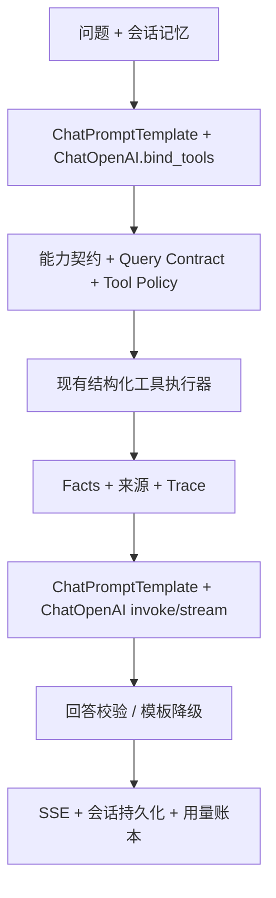

# LangChain 接入与面试说明

2026-09-10：模型调用层默认使用 `langchain-core==1.6.2` 和 `langchain-openai==1.6.2`，保留原有 Requests 适配器作为显式回退。使用 LangChain 的模块化包，不需要安装包含更多能力的 `langchain` 顶层包。

## 实际承担的职责

| 组件 | 项目实现 | 作用 |
| --- | --- | --- |
| Chat Model | `AuditedChatOpenAI` / `LangChainChatProvider` | 统一普通调用、原生函数调用和流式调用 |
| Prompt Template | `ChatPromptTemplate` | 以变量传入 system 与 user 内容，保留 Facts JSON 中的花括号 |
| LCEL / Runnable | `PROMPT \| model` | 将提示模板和模型组合为可 invoke/stream 的链；使用 run name 区分调用 |
| Tool Binding | `bind_tools` + 指定 `tool_choice` | 让 Planner 调用 `submit_agent_plan`，让滚动记忆调用 `update_session_memory` |
| Message / Chunk | `AIMessage` 与流式消息块 | 解析函数参数、累积文本，并把增量交给既有 SSE 回调 |
| Provider Adapter | `LLMResult` | 接回已有耗时、token、失败统计、Trace 和模板降级体系 |

相关代码：`backend/app/services/langchain_provider.py`、`backend/app/services/llm_provider.py`。



图中是逻辑职责；普通流式回答的 delta 仍按原实现直接发送，最终校验不能撤回已经发送的文本。本次没有改造该既有边界。

## 保留的业务控制权

Planner 选择业务能力；后端映射工具并编译日期、窗口、市场、排序和数量。LangChain 不直接执行市场工具，也不计算评级或修改评分策略。原有 Tool Policy、profile 权限、Facts-first、SQLite 会话记忆与离线评测继续生效。

这次接入没有引入 `create_agent`、AgentExecutor、LangGraph、向量 RAG 或多 Agent 自主讨论。LangSmith 的包是框架依赖，但本项目没有配置或启用托管追踪；已有 SQLite 审计继续承担运行观测。

## 配置与回退

安装：`backend/.venv/Scripts/python.exe -m pip install -r backend/requirements.txt`。

```dotenv
LIMITUPLAB_LLM_ENABLED=true
LIMITUPLAB_LLM_BACKEND=langchain
LIMITUPLAB_LLM_BASE_URL=https://api.deepseek.com
LIMITUPLAB_LLM_MODEL=deepseek-v4-flash
LIMITUPLAB_LLM_NATIVE_FUNCTION_CALLING=true
LIMITUPLAB_LLM_MAX_ATTEMPTS=2
```

API Key 仍只使用原有环境配置，不写入文档或仓库。`LIMITUPLAB_LLM_BACKEND` 未设置时默认 `langchain`；设为 `requests` 并重启服务即可回到原适配器。不因导入错误或配置拼写错误静默切回 Requests。

`LIMITUPLAB_LLM_ENABLED=false` 或缺少密钥时仍使用 Disabled Provider。关闭原生函数调用会走已有 Prompt-to-JSON 路径；模型请求失败仍由上层处理模板降级。

`LIMITUPLAB_LLM_MAX_ATTEMPTS` 控制最多尝试次数；LangChain 由 OpenAI SDK 管理重试退避，`LIMITUPLAB_LLM_RETRY_DELAY_SECONDS` 只适用于 Requests。流式生成开始输出后不重试，避免重复文本。

## 接入中的兼容性处理

1. ChatOpenAI 会将 `max_tokens` 改名为 `max_completion_tokens`。适配器保留既有兼容服务使用的 `max_tokens`，确保 Planner 预算仍有效。
2. LangChain 的标准 usage metadata 会对部分缺失计数填零。适配器保留原始 SSE usage，任一必要计数缺失时将本次用量标为未知，不伪造完整账本。
3. 函数响应必须只有一个名称匹配的调用且参数为 JSON object；缺失、错误名称、无效 JSON 或多个调用均进入已有错误处理。
4. 流式结果必须有文本；中途失败会关闭流并记录失败。Provider/API 错误摘要不包含服务返回的完整响应正文。

前两项使用锁定版本的窄范围内部扩展点。升级 `langchain-openai` 时必须运行线协议测试，检查请求参数和 SSE 计费语义，不能只验证 import 成功。

## 验证方法

- `backend/tests/test_langchain_provider.py` 使用真实 LangChain/OpenAI SDK 与 HTTPX MockTransport，检查线协议、函数名、Schema、模板变量、流式计数、缺失计数、重试和中断清理。
- `backend/.venv/Scripts/python.exe scripts/check_project.py --scope backend` 运行完整后端与离线 Core/Product/Query Contract 评测。
- 本次真实回环 HTTP 验收使用独立 Uvicorn、隔离 SQLite 和模拟 Chat Completions 服务，覆盖 LangChain 普通问答、SSE、Requests 回退及上游失败降级；报告位于未提交的 `output/langchain/http-results.json`。
- 以上不能证明真实模型的回答准确率或线上部署状态。本次没有调用付费模型、重启生产服务或修改生产数据。

## 面试讲法

> 我用 LangChain 的 Chat Model、PromptTemplate、LCEL 和 Tool Binding 接入模型层。Planner 通过原生函数调用选择业务能力，再由自研查询契约与 Tool Policy 编译、校验和执行工具；最终答案基于结构化 Facts 生成。框架负责模型交互，后端负责金融事实和权限边界。接入时还处理了 DeepSeek 参数兼容、流式 token 缺失和中断不重放问题，并用线协议测试、离线评测和 HTTP 验收验证。

如果被追问为什么没有整体换成 `create_agent`：当前工作流已经明确划分规划、受控取证与回答，现有契约覆盖完整名单、交易日和数据缺失。直接替换循环会扩大改动范围；先替换可隔离的模型层能够复用框架，也能用同一套评测比较行为。后续只有出现需要动态重规划、持久化图状态或人工中断恢复的具体需求，才评估进一步引入 Agent/Graph 编排。

官方参考：[ChatOpenAI 与工具绑定](https://docs.langchain.com/oss/python/integrations/chat/openai)、[DeepSeek Chat Completions 协议](https://api-docs.deepseek.com/api/create-chat-completion/)。
