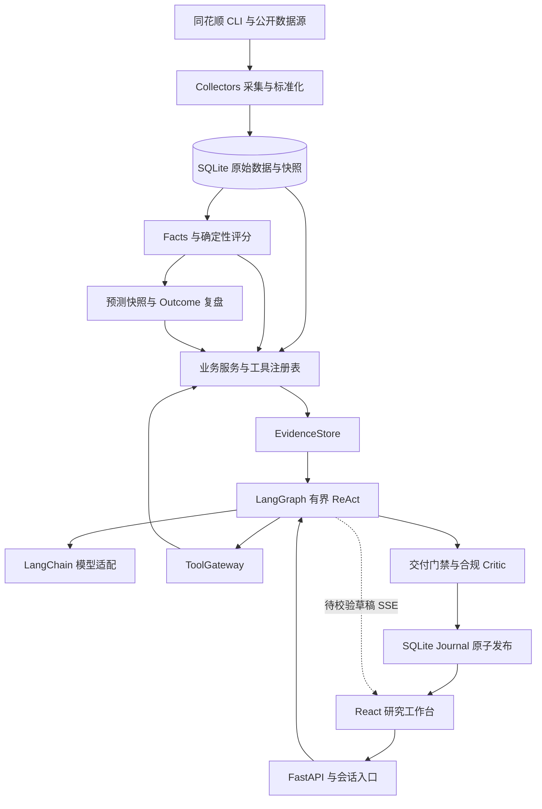
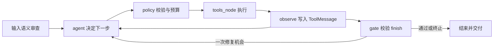

# LimitUpLab 项目实现与 Agent 开发面试准备

更新日期：2026-10-10。面向 Agent／LLM 应用开发岗位，源码核对基线为 `a6ef29b`。本文描述该基线的实际实现；历史评测、故障与发布记录保留各自日期，不能代替当前线上验收。

LimitUpLab 是面向 A 股收盘后研究的工作台：先采集、保存和计算市场事实，再让 Agent 调用受控工具完成查询、解释与追问，最后通过不可变预测记录和后续结果复盘形成闭环。项目的主要价值是把 Agent 的语义决策与可审计的数据工程连接起来。评分有效性仍在验证，系统不输出买卖、仓位、目标价、收益承诺或确定性预测。

面试时最值得展开的是五件事：为什么保留确定性计算，如何约束工具调用，如何区分上下文与证据，如何可靠交付流式回答，以及如何评价 Agent 和评价裁判。

## 阅读路线

- 时间有限：先读第一、四、七、八、十一、十四节，再练习第十七节问答。
- 准备技术深挖：结合第十八节代码索引，沿一次请求走完入口、图、工具、证据、最终提交与持久化。
- 准备现场展示：使用第十九节演示顺序，选择本地实际有数据的日期，不背诵固定股票名单或历史接口数字。
- 准备简历：使用第一节的事实表达，再补充自己真实负责的工作。不要把仓库存在某项功能直接等同于个人独立完成、生产规模或商业效果。

## 一 项目介绍怎么讲

### 三十秒版本

> LimitUpLab 是一个 A 股收盘后研究 Agent。底层用结构化数据和规则完成首板过滤、评分及历史统计，上层用 LangChain 原生工具调用和 LangGraph 有界 ReAct 回答市场、个股与复盘问题。我重点关注 Agent 工程可靠性：工具的参数和日期约束、完整证据与模型预览分离、服务端名单渲染，以及可恢复的 SSE 流式交付。项目同时建立了固定场景评测和独立裁判诊断，当前仍明确保留数据缺失与未通过的边界。

### 三分钟版本

可以按“场景、分工、链路、难点、验证”组织：

1. **场景**：行情看板有数据，但跨市场、板块、个股与历史记录的追问需要频繁切换页面；普通聊天又容易给出没有依据的解释。因此选择收盘后研究，要求每次回答能回到真实工具结果。
2. **分工**：Python 负责候选过滤、14 因子评分、集合运算与 Outcome 统计；LLM 负责理解问题、选择下一批工具、消歧和组织解释。高分与高置信度分开表达。
3. **链路**：请求先建立持久化 run，Input Reviewer 解析任务与日期，然后进入 ReAct。ToolGateway 校验权限和参数；完整结果进入 EvidenceStore，模型拿到预览和证据 ID；最后单独调用 `finish`，经过交付检查与独立合规 Critic 后持久化并发布。
4. **难点**：长名单由模型抄写会补造，历史回答会污染当前事实，工具超时容易被解释为空，SSE 重连容易重复执行。这些问题分别通过服务端证据表、当前轮证据约束、结果状态契约和持久化运行处理。
5. **验证**：离线回归覆盖协议与业务边界，Golden 在冻结合成环境中运行生产 Agent，结合确定性验收和独立模型裁判。裁判本身也要校准，不能把自动分数直接当作真实业务正确率。

如果被问到“你具体做了什么”，接着讲一项自己实际参与、能打开代码解释的改动，按问题、根因、方案、验证、剩余风险展开。没有测量过的吞吐量、响应时间改善、成本下降和投资效果，不写进个人成果。

### 十分钟展开顺序

先画整体架构，再走一条 ReAct 请求；选择“长名单幻觉”或“断线重复执行”深入讲；然后展示 Golden 如何捕获失败；最后说明单进程部署、自由文本事实校验与评分有效性仍有哪些限制。这样比按技术栈名称逐个介绍更容易形成完整论证。

## 二 背景与问题定义

### 业务背景

收盘后的研究问题通常包含多个层次：某日哪些股票收盘封板，哪些属于首板，哪些符合研究候选条件，评分依据是什么，历史同类样本后来如何表现，以及新追问是否改变了日期或范围。

这些问题既有语义理解，也有严格计算。比如“它们里面评分最高的三只”涉及指代、集合范围与排序；“后来有没有晋级”还涉及预测当时可得信息、后续交易日和结果成熟度。只生成一段流畅回答无法证明这些条件被正确执行。

### 关键术语

| 术语 | 项目中的含义 | 容易混淆的地方 |
| --- | --- | --- |
| 首板 | 当日首次进入连续涨停序列的事件类别 | 事件总体不等于通过过滤的评级候选池 |
| 炸板与盘中开板 | 未回封的炸板与开板后重新封住分别处理 | “曾经触板”不能自动当成收盘涨停 |
| 一进二 | 首板股票在后续目标交易日是否晋级二板的研究标签 | 不能从评分直接推导晋级概率 |
| Facts | 从原始事件、K 线及增强数据构建的结构化事实 | 不是模型自由生成的分析段落 |
| Prediction Snapshot | 当时固定的名单、评分和时间元数据 | 不能事后按新规则重算后冒充原预测 |
| Outcome | 后续真实交易日的价格与晋级结果 | 未成熟不等于失败，缺数据不等于零收益 |
| Evidence | 本轮工具结果及其来源、缺失、范围信息 | 历史助手回答和会话记忆不是当前市场证据 |

### 为什么适合学习 Agent

这个场景同时要求工具选择、参数补齐、动态依赖、上下文控制、数据时效、结构化输出和错误恢复，能够暴露“模型能调用工具”之后的大量工程问题。项目可以用同一套业务事实检验不同 Agent 实现，而不是只观察回答听起来是否合理。

产品边界是收盘后和历史研究，包含盘前研究名单固化。当前不提供交易执行、实时盯盘系统或面向未涨停股票的首板挖掘；集合竞价实验已经退役。页面中的“盘前推荐”是既有功能名称，面试介绍应解释其研究属性。

## 三 当前功能和实现边界

| 功能 | 已实现内容 | 边界 |
| --- | --- | --- |
| 市场工作台 | 市场概览、首板、连板、炸板、涨跌停池、近期涨停、晋级统计 | 各模块分别加载和报告错误；本地数据新鲜度单独判断 |
| 个股详情 | 日 K、收盘后分时复盘、涨停事件、评分拆解与补充事实 | 分时接口服务复盘，不代表实时交易系统 |
| 首板评级 | 候选过滤、Facts、因子评分、评级、置信度、风险和缺失 | 规则评分可解释，但尚未证明具有稳定预测优势 |
| 盘前研究 | 一进二接力、缩量整理、高位回撤三个入口 | 后两类形态研究不混入一进二前向评价 |
| 对话 Agent | 原生工具调用、有界 ReAct、追问、证据表、流式回答 | 默认 profile 限制工具；查询与回答可能是 partial |
| 会话管理 | 新建、恢复、重命名、永久删除、滚动记忆 | owner/session 隔离，不建立跨会话市场事实记忆 |
| 预测与复盘 | Top10 快照、D+1 至 D+5 追踪、全市场首板对照、复盘快照 | 严格区分盘前终选、收盘基线和历史补算 |
| 策略治理 | Champion/Challenger、影子优化、质量审计、因子诊断 | 受门槛与显式启用控制，不自动改写线上策略 |
| 运行治理 | trace、缓存、真实 usage 账本、限流、取消、重连 | worker 和部分协调状态按单进程设计 |
| 评测 | 离线回归、Golden 场景、独立裁判及裁判诊断 | 合成环境覆盖不完整，自动判断仍有待复核项 |
| 部署 | Docker Compose、Nginx、持久化卷、任务脚本、备份和发布流程 | 具备单机部署基线，不宣称高可用集群 |

### 轻量 Agent 角色的真实职责

| 角色 | 实现分工 |
| --- | --- |
| Chat Agent | LLM 在 ReAct 图内选择工具并提交回答 |
| Input Reviewer | 结构化语义审查，识别请求类型、上下文范围、日期、缺失槽位和展示要求 |
| Facts Builder 与 Rating Engine | 确定性业务代码，不依赖 LLM 计算原始分数 |
| Explanation Agent | 根据 Facts 解释评分与风险，独立功能可降级 |
| First Board Critic | 以结构化规则复核评级是否过度乐观、数据是否不足 |
| Answer Compliance Critic | 独立模型审查最终回答是否越过投资合规边界 |
| Review 与 Evaluation | 基于已保存预测和 Outcome 做追踪、分类及经验总结，部分总结可使用 LLM |

这里的“多 Agent”主要指有边界的职责划分。并非每个角色都是独立 LLM，也没有多个自主 Agent 无约束地互相辩论；业务评级 Critic、回答合规 Critic 和 Golden 裁判是三种不同角色。

## 四 整体技术架构



前端通过 FastAPI 查询确定性业务接口，也通过聊天接口发起持久化 Agent 任务。聊天与页面复用业务服务及数据仓库，使“页面看到的名单”和“Agent 查询的名单”有共同来源。数据更新由独立脚本和任务驱动，不依靠用户每问一句就重建全部市场数据。

| 层次 | 主要目录 | 责任 |
| --- | --- | --- |
| 接口与鉴权 | `backend/app/routers`、`security.py` | HTTP 参数、owner 隔离、SSE、管理接口保护 |
| Agent 编排 | `backend/app/agents/react_runtime` | 决策、调用前校验、证据、交付、运行日志 |
| 工具契约 | `backend/app/agents/tools.py`、`tool_schemas_*.py` | 按领域组织契约，经统一注册表暴露工具名称、参数、时间能力、集合语义和业务适配 |
| 业务服务 | `backend/app/services`、`agents/first_board.py` | 特征、评分、研究、复盘、记忆与模型适配 |
| 持久化 | `backend/app/repositories`、`database.py` | SQLite 访问、快照、运行记录、usage 与缓存 |
| 数据源 | `backend/app/collectors` | 同花顺、AKShare 等来源的超时、标准化和缺失处理 |
| 评测 | `backend/evals/golden`、`backend/tests` | 合成世界、验收契约、裁判和回归 |
| 前端 | `frontend/src` | 工作台、局部资源状态、图表、会话和草稿缓冲 |

仓库使用 Python 3.13、FastAPI、Pydantic、SQLite 和 pytest；前端使用 React 19、TypeScript、Vite、React Router、lightweight-charts 与 react-markdown。核对基线锁定的后端依赖包含 `langchain-core==1.6.2`、`langchain-openai==1.6.2`、`langgraph==1.0.5` 和 `openai==3.26.0`，这是仓库依赖版本，不是对这些库最新版本的说明。

## 五 数据采集与日更闭环

### 数据怎样进入系统

采集层连接同花顺 CLI、AKShare 及公开行情接口，业务层统一为项目的数据模型，再保存到 SQLite。不同数据类型有不同来源与回退策略：事件池、K 线、行业、涨停原因、人气与龙虎榜不能简单当成一张同质表。

同花顺通过后端 Collector 封装命令行调用。业务 Agent 看到的是类型化研究工具，不会直接生成任意 shell 命令。外部接口失败、结果不完整、历史数据不足和真实空结果分别表达，不用一次回退成功掩盖所有缺口。

### 日更的核心步骤

入口是 `backend/scripts/run_daily_close_loop.py` 与 `update_daily_data.py`，主要工作包括：

1. 确认目标交易日、运行记录与重试范围。
2. 采集涨停、炸板等原始事件，补充涨停原因并检查事件池数量一致性。
3. 获取所需 K 线及增强数据，构建并持久化结构化特征。
4. 执行首板过滤、确定性评分与 Top10 快照写入。
5. 回填旧预测后续交易日 K 线与 Outcome，检查 D+1、D+3、D+5 完整性。
6. 生成健康与运行报告；仍缺数据时保留 partial，并在后续窗口继续追补。

重试必须结合操作语义：原始事实可按业务键幂等写入，历史预测原件不能因重跑而覆盖。脚本成功退出、数据源成功返回、当日数据完整是不同层次的状态。

### 为什么特别处理超时

部分第三方同步采集可能卡在底层网络请求。线程上的等待超时只能让调用方停止等待，无法保证底层线程退出。因此部分 AKShare、指数与交易日历调用使用可终止的 spawn 子进程，父进程承担截止时间、清理和结果接收。

这属于对特定不受控调用的隔离。它带来进程启动、序列化和缓存归属成本，并不意味着所有工具都可强制中断。成功缓存、并发请求合并与等待上限配合使用；超时不能把旧数据标成当前成功结果。

## 六 Facts 与可解释评分

### 候选过滤先于评分

一进二研究默认从收盘封住的首板中筛选，排除 ST、北交所、科创板、创业板、新股与次新股，以及成交额不足的样本。通用首板评级池与一进二预测池的范围不同：`build_first_board_ratings` 的通用硬过滤不排除创业板，300/301 的排除由一进二候选范围层执行。过滤资格与评分高低是两个步骤：被过滤股票不能解释成低评级股票，“没有评级记录”也不能解释成“没有涨停”。

Facts 由事件事实、涨停前走势结构、行业与市场环境、市值、人气、龙虎榜和缺失说明构成。输入结构化以后，评分可以复算和单测，LLM 的措辞变化不会改变原始分数。

### 当前默认评分规则

代码默认策略版本是 `first-board-rule-v5-board-shape-market-cap`，共 14 个因子。默认权重如下，运行中的活动策略仍应通过策略状态接口确认。

| 因子 | 权重 | 因子 | 权重 |
| --- | ---: | --- | ---: |
| 首封时间 | 12 | 上板形态 | 10 |
| 封板稳定性 | 13 | 封板次数 | 6 |
| 换手率 | 7 | 成交额 | 5 |
| 行业热度 | 4 | 市场环境 | 4 |
| 涨停前走势结构 | 12 | 板块强度与接力 | 7 |
| 市值偏好 | 10 | 近期股性 | 3 |
| 龙虎榜资金 | 3 | 市场人气 | 4 |

各因子按规则得到分项，再按策略权重汇总。A/B/C/D 的分界为 80、65、50。单股评级包含 `score`、`rating`、`confidence`、`score_breakdown`、`reasons`、`risks` 与结构化 `facts`；缺失在 `facts.data_missing`，评级响应的规则版本在 `generated_by`，持久化预测记录再使用 `scoring_version` 保存评分版本。

`first-board-rule-v6-reason-aware-shadow-1` 是显式构建的原因感知 Challenger，不应描述成默认线上评分。文档中“优化 v3”等版本也不能直接等同于评分规则 v3，版本所属组件需要讲清。

### 分数与置信度为何分离

分数表达规则定义下的候选强度；置信度表达数据完整程度与规则支持程度，并受到缺失和环境等因素影响。它不是经过统计校准的晋级概率，`confidence=0.8` 不能解释为“八成会成功”。

当前实现中，部分缺失增强数据会使用明确的中性分，同时写入 evidence、`data_missing` 并降低置信度。例如 K 线不足时相关结构因子存在中性处理。面试时不能声称“任何缺失都完全不打分”；关键是缺失不能被伪装成已观测的正常值，使用的中性规则应可追溯。

### 可回放还缺什么

已有评分版本、输入 Facts、逐因子拆解和历史快照，为复算提供基础。但部分分箱和阈值仍在代码中，权重版本并未完整代表全部规则语义。若继续完善，应把阈值、过滤条件、特征算法和数据时点一起纳入版本与指纹，而非只保存一个权重字典。

## 七 一次 Agent 请求如何执行

### 入口与图的分工

`POST /api/agents/chat` 和 `POST /api/agents/chat/stream` 共享持久化运行机制。`routers/react_chat.py` 处理 owner、会话、幂等和 worker；`agents/chat.py` 是薄入口，最终调用 `react_runtime.runtime.run`。

进入图之前，Input Reviewer 通过强制结构化 tool call 返回任务理解结果，识别研究请求、独立问题或追问、待补用户信息和输出格式。输入审查链路还结合确定性日期解析，生成明确日期约束。审查失败时不放行后续数据查询；缺少必需用户信息时，只允许先通过 `finish` 澄清。



实际图在模块级通过 `StateGraph` 构建并 compile。状态保存消息、待执行调用、观察结果、finish 和结束标记，运行对象管理计数、证据、deadline 与日志。

### ReAct 在这里具体是什么

模型看到问题、受控上下文及先前的 `ToolMessage`，提出下一批原生 tool calls；工具执行后结果作为 observation 回到消息序列，模型再决定继续查询还是完成。这里不展示模型内部思维过程，也不靠解析“Thought/Action”文本执行命令。

互相独立的调用可以在一轮发出；依赖上一轮名单的调用必须等到结果返回。例如先查候选，再选择其中一只获取 K 线，不能在候选工具尚未返回时猜股票代码。`finish` 必须单独调用，不能与仍在获取证据的工具混在同一批次。

### 一个不依赖固定行情的例子

用户先问：“列出指定交易日主板首板，只要代码和名称。”

1. Reviewer 识别日期、主板、首板和只列表格要求，字段绑定为 `symbol`、`name`。
2. Agent 调用能覆盖该问题的事件工具，例如带日期和事件条件的 `limit_up_events`。最终参数仍由 Schema 和 Gateway 校验。
3. 工具返回结构化事件，EvidenceStore 保存完整 rows；模型看到证据 ID、预览、数量与来源范围。
4. Agent 单独提交 `finish.table`，正文只包含 `{{evidence_table}}`。服务端按证据实际行渲染两列。
5. Gate 检查字段顺序、证据、状态与范围，再进入合规检查；最终响应持久化后发送 `completed`。

用户追问：“其中哪些有评级，按分数排序？”本轮可以引用上一轮实体和实际查询参数来理解“其中”，但需要重新查询当前要求的事实。事件工具全集、评级候选集和二者交集的含义必须保持区分，不能把某个集合的数量套到另一个集合。

### 为什么使用自定义 LangGraph

项目需要在调用前后控制研究 profile、历史日期能力、集合完整性、证据存储、调用回放与最终交付，因此使用自定义图节点。LangChain 负责消息和工具调用适配，LangGraph 负责图与循环，业务约束仍由项目代码维护。

当前没有直接使用 `MessagesState + ToolNode + LangGraph checkpointer/thread_id` 的完整组合，持久化由自建 SQLite Journal 承担。这个选择便于控制业务语义，但增加了状态维护、协议兼容和恢复测试成本；后续是否迁移，应比较能否保留行为并减少重复代码。

## 八 工具调用与 Tool Policy 的实现

### 公开工具契约只有一个来源

26 个业务工具的公开契约分别定义在 `agents/tool_schemas_market.py`、`tool_schemas_research.py`、`tool_schemas_review.py`、`tool_schemas_news.py`，使用 `tool_contracts.py` 中的共享类型，由 `agents/tools.py` 统一导出。契约包含参数 Schema、时间能力、日期字段、集合语义及适配模式。`react_runtime/catalog.py` 由该契约生成 Pydantic 参数模型和 LangChain `StructuredTool`，并检查直接实现的方法签名是否漂移。

这里的“唯一来源”指同一工具只有一份契约定义，并不要求所有定义堆在一个文件。按领域拆分后，注册表保留原顺序和对象引用，现有调用方的导入路径不变；修改某个工具仍只需修改所属领域的一份契约。这也是面试中解释重构取舍的具体例子。

默认 `v1_close_review` profile 暴露 24 个业务工具；`remote_limit_up_pool` 和 `web_search` 仅在 `extended` 研发 profile 中开放。此外有 4 个运行时控制工具，不能把它们与 26 个业务工具混计。

| 工具类别 | 代表工具 | 使用场景 |
| --- | --- | --- |
| 市场与事件 | `market_summary`、`market_event_pool`、`limit_up_events`、`daily_board_promotion` | 概览、名单、数量、事件条件和晋级 |
| 行业与人气 | `sector_performance`、`sector_stock_ranking`、`hot_stock_ranking` | 板块及股票横向观察 |
| 个股与资讯 | `stock_kline`、`stock_news`、`stock_activity`、`dragon_tiger_list` | 个股走势、近期事件与来源资讯 |
| 评级与复盘 | `first_board_ratings`、`first_board_critic`、`rating_evaluation`、`review_high_score_picks` | 解释评分、质疑与结果追踪 |
| 形态与审计 | `post_limit_screen`、`post_limit_path`、`post_limit_statistics`、`prediction_quality_audit` | 形态筛选、历史路径和样本审计 |

完整名称和参数以注册表为准，工具名称不等于数据供应商名称；两个不同工具也可能共享同一个上游来源，不能据此声称独立交叉验证。

### Gateway 的确定性检查

执行前检查工具是否属于当前 profile，参数是否为正确对象，必需字段是否存在，类型、枚举和范围是否满足约束，日期是否可解析，以及股票参数是否满足单个或集合要求。

业务工具参数模型使用严格类型并禁止额外字段。`stock_kline` 要求一只股票，多只股票需独立调用；空 `symbols` 不能意外变成无过滤全量查询。未知名称、越权工具或不支持的参数由后端拒绝，不依靠模型自觉遵守。

控制协议也类型化，但 `Finish` 有兼容旧 checkpoint 的例外：额外字段被忽略，以接受退役 Claim Ledger 遗留字段。不能笼统声称所有模型输入都使用完全相同的严格策略。

### 时间能力为什么进入工具契约

有的工具能查指定历史日期，有的只提供当前快照或本地最新交易日。用户要求历史时点时，拿今天的人气榜回答过去的问题，即使每个数字都来自真实接口，也会产生时点错误。

输入审查完成语义理解后，`prompt_security._time_scope` 从本轮原文中的当前用语及 ISO 风格日期做确定性解析，结果进入 `required_date`；不是由 LLM wire schema 直接返回 `requested_date`。Gateway 对缺省的单日期字段或 `requested_as_of` 补齐后，再检查工具时间能力，并对声明的返回日期做一致性检查。它不会自动改写为另一个可用日期，也不会为完成任务随意新增查询。

复杂相对日期和多日期任务仍依赖语义理解及实际工具参数，当前辅助解析不等于完整自然语言日期解析器；参考日期使用服务端 `date.today()`，部署时区设置也属于正确解释日期的前提。

旧自然语言 Query Contract 编译器已退役。当前 `query_contract.py` 主要保留共享类型、枚举别名与日期辅助函数，不能凭文件名描述成仍在运行的自然语言计划编译器。`PostLimitQueryContract` 则是特定形态研究使用的结构化业务参数对象。

### 控制工具与有限计算

| 控制工具 | 职责 | 限制 |
| --- | --- | --- |
| `update_task` | 维护多项需求的进度与证据引用 | 清单不等于所有用户需求已被形式化证明 |
| `read_evidence` | 按 ID 分页读取本轮证据 | 单次 1 至 30 行；不能猜测隐藏行 |
| `compute_result` | 筛选、排序、切片、去重、集合运算、聚合 | 仅接受声明操作、字段和枚举，不执行任意表达式 |
| `finish` | 提交正文、交付状态、可选表格、引用和缺口 | 必须单独调用并通过后端门禁 |

`compute_result` 支持 `select/intersection/difference/union/distinct/aggregate`；聚合仅有 count、sum、mean、min、max。集合按指定 key 去重，重复成员保留左侧首条记录，不自动拼接两侧指标。集合比较要求足够完整的源集合；派生结果保留父证据、缺失与截断信息。

如果未来要增加任意 SQL 或 Python 工具，会引入权限、资源、数据外泄和不可控计算问题。当前有限算子已经覆盖常用名单研究，优先扩展经过审阅的算子比开放通用执行器更符合项目范围。

## 九 EvidenceStore 与回答事实约束

### 完整结果和模型上下文分开

工具返回的完整 payload、标准化 rows、参数、来源、日期、缺失和状态进入请求级 EvidenceStore。模型通常先看到 8 行预览及 `row_count`、`evidence_id` 等信息，需要分析细节时再分页读取。恢复所需证据随自建 checkpoint 保存，但它不是跨请求共享的市场事实缓存。

两个“截断”必须区分：预览省略只表示上下文没有展示全部已保存行；`source_truncated` 表示上游结果本身不完整。前者可以由服务端渲染完整已返回集合，后者不能因展示完已有行就声称得到全市场全集。

对于有明确排序前缀和范围证明的切片，代码保留受限的排名范围判断。不能把这一特例泛化成“任意截断结果都能回答 TopN”。

### 为什么用服务端证据表

让模型逐行抄写几十只股票容易漏行、重复或补造。`finish.table` 只声明一个证据 ID 与字段列表，由后端输出实际值；筛选与排序先通过确定性计算得到新的证据。每条回答最多一张表、12 列、1000 行，正文中使用一次 `{{evidence_table}}` 占位符。

服务端检查字段是否存在、值是否可展示、范围是否完整以及字段顺序是否满足用户要求。如果用户只要求代码和名称，正常完整回答不能额外加“来源说明”或一段投资分析。对真实缺失、澄清和拒绝则允许必要解释。

### 工具状态与用户交付状态不同

| 层次 | 状态 | 含义 |
| --- | --- | --- |
| 工具结果 | `ok` | 工具返回有效结果 |
| 工具结果 | `empty` | 成功查询得到有效空集合 |
| 工具结果 | `partial` | 有结果，但存在影响完整性的缺失或截断 |
| 工具结果 | `error` | 查询失败，无法据此判断业务事实 |
| 最终交付 | `complete` | 用户要求的允许研究内容已经交付 |
| 最终交付 | `partial` | 仍有具体允许研究内容未完成，需要非空 `missing` |
| 最终交付 | `empty` | 用户要求名单，完整成功查询没有匹配项 |
| 最终交付 | `clarify` | 缺少必须由用户补充的信息 |
| 最终交付 | `refuse` | 请求仅包含不允许的交易建议等内容 |

例如，用户问“有没有评级记录”，有据回答“没有”可以是 complete；用户要求“列出评级记录”而完整查询为空，可以是 empty。服务超时只能说明查询失败，不能回答“没有”或“数量为零”。研究与交易建议混合时，拒绝交易建议后，允许部分若已交付，不应仅因拒绝内容而强行标 partial。

研究回答以 complete、partial 或 empty 结束时，Gate 要求引用本轮证据，拒绝仅用 error 证据声称 complete，拒绝把 error/partial 伪装成 empty，拒绝 `complete` 同时携带未完成项。clarify/refuse 不要求为澄清或拒绝而强行查询。运行中断还可能产生 error 或 cancelled，不能把这些运行状态直接等同于 `finish` 的五种声明。

### 已实现门禁的上限

这些检查能约束证据存在、当前轮范围、表格一致性和状态矛盾，但不能证明自由正文每个数值、因果解释及筛选声明都正确。Claim Ledger 已退役，当前没有通用逐句标量绑定校验。

例如，“未进入评级候选池”不能推出“未涨停”；“两个来源返回相同名单”不能推出“上游独立”；“没有找到支持材料”也不等于“结论被证明错误”。开放文本需要 Golden、反例和人工审阅继续约束。

## 十 上下文 记忆与安全

### 记忆负责连续性

SQLite 保存会话原文和滚动 Session Memory，以 `owner_id + session_id` 隔离，使用 `last_message_id` 增量更新。记忆保留研究目标、偏好、实体、日期范围与未解问题；摘要更新失败可以回退到现有记忆和近期消息，不让可选摘要阻断聊天。

会话服务保留有界消息窗口，默认近期窗口为 8 条，选取上下文上限为 16 条。进入生产 ReAct 前还会进一步区分用途，不能把这个上限解释成模型直接重放 16 条历史市场回答。

### Reviewer 与 ReAct 接收的历史不同

Reviewer 使用有界近期用户意图、偏好、上一任务及澄清信息理解本轮请求。ReAct 默认不重放历史答案正文或历史市场证据；只有被判定为 follow_up 时，才加入历史股票身份和上一轮实际工具参数，帮助理解“它们”“同样条件”等指代。

`context.py` 的主要字符预算为 12,000，历史实体上限为 32。过长约束会整项舍弃并记录省略，避免在否定词或条件中间截断造成反义。字符预算是实现中的控制方式，不等于精确 token 预算。

本轮明确条件优先于历史条件；历史市场事实必须重新查询。用户说“还是这个日期”可继承意图，但不能把上一轮价格直接升级为本轮事实，也不能让旧的未解问题自动变成当前待办。

### 安全的多层约束

输入语义 Reviewer 检查越界或注入请求，ToolGateway 确定性限制实际能调用的工具，输出门禁限制证据与交付，独立合规 Critic 检查交易指令、仓位、目标价、收益承诺和确定性预测。审查调用异常按失败关闭处理。

新闻、网页、历史消息和工具返回中的自然语言都是不可信数据，不能修改权限或系统指令。模型审查仍可能误判，因此最终能力边界要落在执行层，不能只写“请忽略恶意指令”的提示词。

当前普通流式草稿可能在最终合规审查前已被用户看到，后续撤回无法抹去这一事实。更严格的使用场景可以考虑延迟展示至审查通过，但会增加首字延迟；当前评测因此同时审查最终答案和已经展示过的草稿。

## 十一 流式回答与持久化运行

### 真正流式的是 finish.answer

`LangChainChatProvider.generate_messages` 接收原生 `AIMessageChunk`。`answer_stream.py` 增量解码单个 `finish` 调用顶层的 `answer`，完整工具 JSON 参数仍要等流结束并通过验证后才执行。普通模型文本、其他工具参数与内部推理不直接展示。

| SSE 事件 | 前后端约定 |
| --- | --- |
| `accepted` | 返回 run 与会话标识 |
| `progress` | 展示准备、规划、查询、检查等阶段 |
| `answer_start` | 开始新的 revision，正文标为 provisional |
| `answer_delta` | 按 Unicode 码点 offset 追加正文 |
| `answer_reset` | 撤回当前草稿 |
| `completed` | 返回已持久化权威响应，替换临时正文 |

前端 `agentAnswerBuffer.ts` 处理 revision、重复片段和偏移，按动画帧合并显示。表格占位符及后续正文先缓冲，待服务端渲染后接入；严格 table_only 草稿暂缓到展示约束检查通过。普通正文保留 provisional 流，若最终校验失败则撤回并允许一次修复。

### 为什么 SSE 之外还需要 Journal

网络连接只是交付通道，不能承担任务唯一性和最终状态。Journal 保存 run、事件、checkpoint、工具调用记录与取消标记，使浏览器断线和任务执行解耦。

| 情形 | 当前行为 |
| --- | --- |
| 重复 POST 相同请求 | 按 `owner_id + session_id + message_id` 复用 run |
| 同 message_id 使用不同请求内容 | 返回冲突，避免把旧结果套给新问题 |
| 同会话已有活动任务 | 通过会话活动运行约束防止重叠执行 |
| GET 重连 | 只读已有事件与最终结果，不启动模型或工具 |
| 运行中重连 | 从 `after` 游标继续读取持久化事件 |
| 已完成运行重连 | 返回最终响应，不重播已撤回草稿 |
| 显式重复 POST 恢复 | 利用保存的 checkpoint，清理旧草稿并延续 revision |
| 已登记调用但结果未保存 | 标记 `UncertainExecution`，不盲目重发远端请求 |

工具调用以 run、call ID 和参数 signature 记录，已知完成结果可回放；同一运行的相同业务调用还可复用已获得的 ok/empty 证据，partial 不按完整成功缓存。最终聊天消息、运行记录与 `react_runs.response_json` 在同一事务中保存；提交后，SSE 读取已持久化响应并生成 `completed`，该事件本身不写入 `react_events`。

### 不能夸大成什么

这不是分布式 exactly-once。请求幂等、工具结果复用、数据库原子提交分别解决不同问题；外部工具已经执行而结果尚未落库的窗口仍存在。GET 重连不会自动恢复中断计算，恢复需显式重新提交同一请求，且仍受最初运行的总时间预算约束。

worker、线程池和部分锁属于单进程设计。取消是协作式的，可以阻止新调用并清理交付草稿，已经进入底层网络库的请求可能稍后结束。多进程、多实例部署需要额外的租约、队列和共享协调机制。

## 十二 调用预算 成本与失败处理

| 约束 | 当前默认值或行为 | 应怎样解释 |
| --- | --- | --- |
| ReAct 决策调用 | 最多 8 次 | 不包含独立输入审查、合规审查及可能的记忆摘要调用 |
| 业务工具执行 | 最多 8 次 | 同运行相同请求命中复用时不重复执行 |
| 非 finish 控制调用 | 最多 16 次 | 防止无休止读证据和计算 |
| 工具并发 | 3 | 进程级线程池，不是每个用户独占 3 个执行槽 |
| 总运行 deadline | 默认 120 秒，可配置 | 限制继续执行，不保证所有底层请求同时被杀死 |
| 决策单次模型调用 | 最多 35 秒且受剩余预算约束 | 不是固定等待完 35 秒 |
| 最终校验修复 | 最多一次 | 门禁反馈用于修复整份交付契约 |

接近预算上限时，只暴露 `finish`，要求交付已取得事实并说明缺口。模型决策请求累计失败达到两次、deadline 到期、取消或再次校验失败都会终止，保留真实停止原因，不把失败伪装成正常研究答案。

ReAct 的 `generate_messages` 使用请求级 SDK 配置 `max_retries=0`，输入和合规审查也走该路径，避免底层隐式重试叠加运行时控制。通用 LCEL 文本或记忆调用仍可能按自身配置重试，应分别记录逻辑调用与实际尝试。

生产聊天要求支持原生消息工具调用的 LangChain Provider。关闭 LLM 或缺 Key 时，确定性数据和评分等功能仍可运行，独立 Explanation 可以降级；聊天不会回退到旧通用模板并声称完成。保留的 Requests 文本 Provider 不等于聊天运行时回退后端。

`agent_usage_events` 记录已接受及被拒绝请求、真实 token、耗时及估算成本。成本依赖明确配置的价格，usage 缺失不能自行用字符数冒充真实 token。限流区分访客、IP 与全局约束，但进程内计数的部署边界需要保留。

面试可提出的进一步优化包括：按工具延迟与价值动态分配预算、减少重复 Schema token、精细记录 TTFT 与总延迟、评估有界批量工具。未完成测量前，不声称已降低了多少成本或延迟。

## 十三 预测快照 Outcome 与策略治理

### 预测时点决定样本资格

`prediction_source=live` 是兼容字段，本身不足以证明前向资格。现行 `prediction-time-v2` 按 Asia/Shanghai 解释：目标交易日 08:00 至 09:30 前允许盘前终选；09:30 已超窗；新收盘基线要求基准日 15:30 后。v1 历史终选仍按原 09:00 起点验证，不能批量改写为新契约。

| 样本阶段 | 用途 |
| --- | --- |
| `premarket_final` | 具有截止时间、目标交易日及日历证据，参与现行严格前向评价 |
| `close_baseline` | 收盘研究基线，单独观察 |
| `legacy_close` | 缺少新契约元数据的旧版收盘记录，按原阶段研究 |
| `historical_backtest` | 历史补算，不算当时真实发出的预测 |
| `invalid_time` | 时间或日历等不满足契约，排除 |
| `retired_auction` | 退役竞价实验，排除现行评价 |

盘前终选必须对应基准日后的下一真实交易日，并保存信息截止及日历来源。代码检查已经记录的行情、新闻、增强信息等时间戳，提交前重新核验真实时钟，跨过开盘边界时回滚。该检查约束已声明的信息时点，不证明每条上游数据都具有完美的历史可得性证据。

### 不可变与合法替换如何共存

普通日更不能覆盖已经保存的收盘预测。合法盘前终选可以接替活动收盘批次，但会先将原快照整行与逐股记录追加归档，归档、切换与新终选写入在同一事务中完成。终选前允许更新草稿；同一目标日已有终选时，重复刷新复用已固化结果，不再次替换终选。

因此“不变”的是当时的预测原件，不是所有指向活动批次的索引永远不变。审计添加旁表标记与内容哈希，保留原始预测和旧复盘正文。

### Outcome 怎样避免错位

D+1、D+3、D+5 按预期市场日期精确匹配，不用“下一根有数据的 K 线”替代缺失日。部分回填和完整性计算以本地事件日期构造交易日序列，因此仍依赖本地日期覆盖完整性，不能声称每条 Outcome 都经过外部交易日历核验。后续记录包含开高低收、晋级标签及以次日开盘等明确基准计算的描述性收益和回撤。

未到评价日属于未成熟；已到日期但缺 K 线属于待回填。系统在追补窗口内重试，并将缺口反映到日更、健康检查和 Review。描述性收益不包含一套完整可交易策略的成交、滑点和成本假设，不能直接讲成可实现收益。

### Champion 与 Challenger

优化以日期顺序的扩展窗口 walk-forward 组织训练、验证和测试，测试日期不重叠，重点观察 Top10 相对同期首板总体的晋级改善，并把收益、下跌率与回撤作为保护条件。对照还包含最早封板、固定随机及 Outcome 可用候选池等确定性基线。

Challenger 默认影子运行，晋级门槛包括至少 60 个晋级标签完整交易日、3 折、8 个独立样本外测试日及 50 个样本外 Top 样本，还需通过改善幅度和风险约束，满足条件后仍需显式启用。这些优化样本门槛不等于已经拥有相同规模的合格前向终选样本。权重调整幅度受限；相对调整裁剪发生在重新归一化前，不能把它解释成最终每个归一化权重都严格不超过该比例。

因子诊断还包含按交易日的横截面 IC、显著性校正、样本外联合模型和排序消融。它们用于检验规则假设及发现错误来源，不能用小样本不显著结论证明“因子一定无效”，也不代表系统具备无人值守的自我进化能力。

## 十四 怎样验证 Agent 的质量

### 三种验证对象要分开

| 验证对象 | 方法 | 不能证明什么 |
| --- | --- | --- |
| 确定性代码和协议 | pytest、前端测试、构建、Schema 与故障注入 | 不能仅凭通过单测证明真实模型答题可靠 |
| Agent 研究交付 | Golden 合成世界中运行生产 Agent，检查输出与轨迹 | 不能代表全部真实市场问题与真实数据源质量 |
| 评分研究有效性 | 不可变预测、成熟 Outcome、时间分组与样本外对照 | 不能把 Agent 问答通过率当成股票预测准确率 |

### Golden 的工作过程

`backend/evals/golden` 定义冻结合成世界、独立用例与答案 oracle。模型运行生产 Agent 的实际工具选择、证据和交付逻辑；数据依赖切到隔离 SQLite 与合成工具。合成名单跨日期、市场、板数和事件状态设置干扰项，错误参数会获得不同结果。

当前主套件 `agent-golden-v1.7` 有 61 个场景、84 个用户回合，包含单轮、多轮、异常和安全问题。标准答案与验收约束不放入被测模型提示，合法的等价工具路径可以通过，不把某次成功轨迹当作唯一标准答案。

名单和格式首先确定性检查：漏行、多行、重复、日期、列顺序、引用、状态及调用限制。验收器独立解析实际交付，不调用生产 renderer 生成预期答案后自证正确。自由文本和复杂语义通过两阶段独立裁判检查，分别关注交付与已展示内容。

工具失败、源截断、过期数据和注入通过变体构造。撤回的草稿仍进入可见输出审计，不能只挑最终正确版本评分。报告区分通过、失败、待复核与模拟环境错误，保留配置、运行指纹、原始输出和证据引用。

### 为什么还要评价裁判

LLM 裁判可能增加用户没要求的交付条件，把工具标签误当供应商，或把“证据不足”误判成“明确错误”。裁判返回合法 JSON 只证明协议可解析，不证明判断正确。

项目使用人工可审阅的对照样例、错误变体、重复判定和人工定向标注诊断裁判。引用 ID 需要检查用途与对应证据关系，而不只是检查 ID 存在。待复核项不能按通过计算，修订标签和历史原件要保留。

### 可以引用的历史结果

以下是 [V1.5 里程碑](V1.5_Milestone.md) 与裁判记录中的历史数据，不是 2026-10-10 重新跑出的成绩：

| 记录 | 历史结果 | 正确解释 |
| --- | --- | --- |
| 2026-10-06 完整 Agent 基线，Judge v16 | 61 场景中 52 通过、1 失败、8 待复核；自动通过率 85.25% | 待复核不计通过；是该环境和版本下的场景结果 |
| 2026-10-07 Judge v17 两轮专项复验 | 共同未改标签判项合并匹配率 97.35% | 是裁判诊断标签匹配率，不是 Agent 通过率或行情预测准确率 |

v17 专项复验仍未完成裁判可靠性验收，且对应记录明确尚未重跑完整 Agent 基线。默认 24 个业务工具中有 11 个模拟实现，扩展 26 个工具中有 13 个模拟实现；没有覆盖的工具和真实上游故障仍需要补充验证。

已有保留场景已多次运行和复核，不能再称为严格盲测。正式评估应补充按语义家族隔离的新样本、跨模型重复运行，以及真实数据只读回放和人工抽查。

## 十五 工程可靠性与真实问题

### SQLite 和单机部署

SQLite 使用统一连接配置，包括 WAL、busy timeout、有限锁冲突退避与外键；当前源码 Schema 版本为 12。WAL 改善读写并发，但并不允许任意数量写事务同时成功。事务尽量围绕短持久化动作，不能把缓慢网络请求包在长数据库写事务里。

Docker Compose 管理后端、前端、推荐刷新及日更任务，数据落持久化卷。Nginx 提供代理与前端服务，发布流程包含锁、维护保护、备份和核验。统一验收在 Windows、Ubuntu 上执行；标签发布依赖验证通过。

`/health` 是轻量服务存活探针，不执行完整市场查询。因此容器 healthy 不等于外部数据源可用或首页可用，应结合业务接口、数据新鲜度和浏览器路径验收。

### 匿名会话与权限

访客身份由服务端签名的匿名身份机制确定，查询和修改会话都绑定 owner；不能仅因知道 session ID 或 run ID 就访问他人内容。管理能力与普通研究接口分开保护，代理与 IP 的信任范围需要按部署设置。

用户会话、真实 Key、生产环境配置、数据库与生成报告不提交到 Git。面试展示应选脱敏 trace，不展示请求认证信息或其他用户会话。

### 三个值得讲清的实际案例

**长名单补造**：`badCase.md` 中“长筛选名单后半段出现证据外股票”及后续“证据表格交付”记录显示，模型抄写大量股票时会出现来源外实体。修复的核心是改交付协议，由模型选择证据和字段、服务端输出值，再覆盖数量、重复、字段、截断与严格格式。剩余风险是自由正文仍可能出现证据外解释。

**2026-10-09 首页持续加载**：事故记录显示静态资源和 `/health` 正常，但指数与交易日历调用阻塞，前端统一等待多个请求把局部故障扩大为全页加载。后续代码对特定采集增加进程级截止时间，前端按模块独立加载、报错、重试，首页 GET 有 20 秒预算，刷新中止旧请求并忽略过期响应。故障时没有捕获完整 Python 线程栈，因此不能断言最早卡住的具体供应商。

**SDK 版本漂移**：2026-10-07 发布记录中，本地与 CI 的 OpenAI SDK 版本不同，断流异常被不同层级包装，导致测试预期失败。修复明确锁定 SDK，并检查异常 cause、请求次数、连接关闭和 usage 缺失，而不是只放宽异常类型让测试变绿。这说明兼容层要测试真实线协议行为。

这些案例分别体现输出可靠性、故障隔离和依赖治理。具体修复与验收记录见 [Bad Case](../badCase.md)、[首页事故](../deploy/incidents/2026-10-09-homepage-stall.md) 和 [质量审查](code-quality-audit.md)。

## 十六 技术取舍与后续方向

| 选择 | 当前收益 | 成本或限制 | 下一步考虑 |
| --- | --- | --- | --- |
| 确定性评分与 LLM 解释分离 | 可测试、可追溯、便于发现错误归因 | 规则质量需要独立研究 | 完整版本化阈值、过滤条件和特征 |
| 有界 ReAct | 按结果调整后续动作，限制循环和成本 | 复杂任务可能预算不足 | 基于观测评估有界批量与分段交付 |
| 共享契约派生工具 | 减少 Schema、验证器、实现漂移 | 契约生成器本身要测试 | 扩充工具覆盖与协议属性测试 |
| 自建 durable journal | 精确控制幂等、证据与发布语义 | 与图状态生命周期耦合较多 | 评估框架持久化迁移及恢复等价性 |
| 有界证据预览 | 减少上下文体积和抄写错误 | 模型可能误读范围 | 优先把用户交付绑定到结构化证据 |
| 服务端证据表 | 名单值可逐项对应证据 | 单表限制，开放正文仍需检查 | 扩展有类型的多交付契约需同步评测 |
| provisional 流式显示 | 更早显示正文 | 审查失败前内容可能已曝光 | 按风险场景选择延迟发布策略 |
| SQLite 单机 | 部署简单，事务与快照易管理 | 写并发和进程协调受限 | 需求成立后引入共享队列、租约及数据库迁移 |
| 独立模型裁判 | 补足规则难覆盖的语义检查 | 裁判可能系统性误判 | 新盲测、人工校准、重复性与不确定性报告 |

这些是基于当前边界的演进方向。项目尚未实现分布式任务系统、向量检索知识库、模型微调训练或自动交易，不能在面试中当成已有功能介绍。

## 十七 面试官可能怎样追问

以下回答给出技术主线；现场应结合自己的实际贡献和对应代码展开。

### 1 这个项目为什么需要 Agent 而不是一个看板

看板适合固定查询，Agent 处理跨工具问题、指代和条件变化，例如先确定事件范围，再读取评级并比较。固定统计仍由业务代码完成。可以继续讨论何时直接接口更合适：单一固定查询不必强行多轮规划。

### 2 和普通大模型聊天套壳有什么差别

差别体现在可验证的执行链：类型化工具、时态约束、完整证据、确定性运算、结构化 finish、幂等恢复和独立评测。不能只回答“用了 LangGraph”；应该展示错误调用如何被拒绝、错误状态如何被发现。

### 3 LangChain 与 LangGraph 分别做了什么

LangChain 提供 ChatOpenAI、消息、原生 tool call、StructuredTool 与流式 chunk；LangGraph 组织自定义节点和循环。业务权限、EvidenceStore、deadline 和 Journal 由项目实现。追问 checkpoint 时，要明确未使用框架官方 checkpointer。

### 4 你的 Planner 在哪里

当前规划发生在 ReAct 每轮模型决策中，Input Reviewer 负责前置任务理解；没有生产独立全量计划生成器和 Replanner。旧架构可作为演进经验，不能与现行链路混讲。

### 5 为什么从全量计划转向逐轮 ReAct

数据查询常存在动态依赖，完整名单与缺失情况要观察后才知道。逐轮模式让下一步决策基于实际结果，减少对预先计划补丁的依赖。代价是调用轮数与预算管理更重要，固定任务仍适合确定性服务。

### 6 Tool Policy 是提示词还是代码

两者分工不同。工具说明帮助选择，真正的 allowlist、参数类型、日期能力、单股票边界、空集合和预算由 Gateway 与 policy 节点执行。模型生成了一个工具名不等于获得执行权限。

### 7 如何增加一个新工具

先定义业务输入输出和失败语义，再写唯一公开契约：Schema、time_mode、日期字段、collection、adapter 与 profile。实现结构化服务，接入 trace 和 EvidenceStore，补参数、空值、时态、截断及错误测试，最后增加代表性 Golden 场景。不是只往提示词加一句工具描述。

### 8 参数符合 JSON Schema 就安全了吗

Schema 只能证明形状、类型和声明范围。日期是否有历史能力、股票集合是否被错误放宽、返回日期是否被上游回退、工具是否允许执行，都需要语义约束。还要防止描述正确但数据不完整。

### 9 为什么不让模型直接写 SQL 算交集

常用集合与聚合可以由有限算子覆盖，容易约束和回放。开放 SQL 会扩大数据权限和资源边界，也提高结果解释成本。未来若开放，应设计只读身份、表字段权限、成本限制和隔离；这些不是当前能力。

### 10 EvidenceStore 是 RAG 或向量数据库吗

当前它是请求级结构化结果存储，按明确 ID 读取或派生计算，不做 embedding 相似度召回。两者都帮助回答接地，但不能把工具证据存储称为已经实现向量 RAG。将来引入公告知识库时还需处理切分、召回、时点和引用。

### 11 有证据 ID 为什么仍会幻觉

引用存在只能证明某份证据被取到，不能保证正文的每个推论都由它支持。服务端表格能约束列表单元格，开放因果解释仍需语义检查和反例。可以用“无评级记录不等于未涨停”说明这种差别。

### 12 长名单为什么不直接让模型分页输出

分页读取解决模型分析时的上下文体积，但让模型重写全部行仍有抄错风险。当前交付直接引用完整已返回证据由服务端渲染，模型不必读完所有分页。源数据截断必须另外检查，不能把 row_count 当全市场总数。

### 13 历史问题怎样防止混入今天的数据

输入审查链路结合语义任务理解与确定性日期解析，Gateway 检查工具历史能力与返回时点；不支持历史的快照工具拒绝该范围，保留缺口。多轮追问重新取证，历史助手回答不成为当前事实。复杂日期仍需工具参数正确，原始来源的历史可得性也不是日期字段本身就能证明。

### 14 Session Memory 为什么不直接总结行情结论

行情会过时，摘要还可能丢失条件或引入模型错误。记忆主要服务偏好、任务和指代，事实通过本轮工具获取。Reviewer 与 ReAct 分别接收不同的历史材料，并有会话隔离、长度上限和增量游标。

### 15 Prompt Injection 怎么防

从权限边界回答：外部内容是不可信数据，输入审查不能放大执行权限，Gateway 只允许公开工具和受限参数，输出再经证据及合规检查。不能声称单个安全模型或关键词规则能完全解决注入。

### 16 工具并行后怎样处理依赖

同轮只执行独立调用，依赖关系跨 observation 边界推进。拿候选结果以后再选股票查 K 线；不能在同批调用中引用尚未产生的证据。多个调用中一项失败时保留成功结果，并由最终交付契约决定 partial。

### 17 为什么最多八次模型调用还可能有额外费用

八次指 ReAct 决策循环，输入审查、输出合规和可能的记忆摘要还会调用模型。ReAct 原生消息请求关闭 SDK 自动重试，通用 LCEL 路径可能按配置重试。成本以 usage 账本为准，要区分逻辑调用、底层尝试、成功返回 token 与缺失 usage。

### 18 工具超时了直接 cancel Future 不行吗

Future 超时或取消通常不能中止已经运行的线程网络请求，所以部分不可控 Collector 放到可终止子进程。Agent 层取消仍是协作式，已启动请求可能稍后结束。要同时说明用户等待预算与底层资源回收。

### 19 SSE 断线后会不会再调用一次模型

GET reconnect 只读 journal，不启动新任务；前端使用已知 run ID 恢复。重复 POST 则按请求幂等键复用或显式恢复，不能生成新 message ID 伪装成原请求重试。已完成运行直接返回权威答案。

### 20 你实现了 exactly-once 吗

没有分布式 exactly-once 保证。已有请求幂等、完成调用回放和最终事务提交；外部调用已执行但结果未保存时仍不确定，因此返回 UncertainExecution，避免盲重试。跨实例还缺少租约与共享调度。

### 21 合规检查在最后 之前流出的错误怎么办

当前普通正文是可撤回草稿，通过 reset 清理，但用户可能已看到。Golden 也检查展示过的文本。若场景要求审查前零暴露，应改成审查后发布或更严格的分段审批，需要接受延迟成本，不能把撤回说成从未展示。

### 22 empty partial complete 怎么区分

从用户交付目标解释，而非直接复制工具状态。完整查询没有匹配名单是 empty，回答“是否有记录”为零可能 complete，查询失败或必需部分缺失是 partial。模型自报状态还要经过证据、表格与 missing 一致性检查。

### 23 如何证明评测不是自己出题自己放水

标准答案与生产执行逻辑分离，固定世界有干扰项，验收器能捕获主动构造的错误变体，允许等价正确路径，保留失败和待复核。现有公开保留集已经使用过，不能宣称盲测；下一阶段需由独立维护者准备新样本。

### 24 LLM 裁判也会错 怎么办

先用确定性检查处理列表、日期和协议，再让裁判评价语义。对裁判做对照、人工标注、重复判定和引用用途检查，解析失败或证据不足进入待复核。裁判匹配率和被测 Agent 通过率分开报告。

### 25 规则评分为什么需要 LLM

规则本身不需要 LLM。用户理解自然语言追问、跨工具组合和解释风险需要语义能力，评分则要求稳定可回放。若 LLM 不可用，确定性页面与评分仍有价值，但复杂聊天会明确失败或缺口。

### 26 如何避免金融研究里的未来信息泄漏

在预测创建和评价两端控制：保存信息截止、实际生成时点及经日历校验的目标交易日；历史补算独立标记；不可改写原快照；Outcome 按预期日期精确对齐；训练和测试按时间拆分。部分 Outcome 路径依赖本地事件日期覆盖，上游历史可得性也可能仍不完整。

### 27 confidence 能否当预测概率

不能，当前是规则型数据支持分。若要变成概率，需要定义事件、在独立样本外校准并报告校准误差，不能只把规则分缩放到 0 至 1。现有 UI 和解释应保留这个区别。

### 28 Champion Challenger 算自动学习吗

它是受控的候选策略研究：版本化权重、时间顺序验证、基线和风险门槛、影子运行与显式启用。LLM 的复盘建议不能直接改变 Champion，样本不足时保持观察。

### 29 MCP CLI Skill 在项目中分别在哪里

运行时业务工具是 Python 注册表派生的 LangChain 工具；同花顺数据通过后端 CLI Collector 接入。当前主聊天链路没有通用 MCP 客户端或运行时 Skill 加载器。开发阶段可以借助 Skill/MCP 辅助工程工作，但不能把开发工具使用经历写成产品已经集成的运行时能力。

### 30 如果用户量扩大十倍 怎么改

先测并发、工具耗时、DB 锁等待与模型限额，再决定拆分。可能需要共享任务队列、租约、集中限流、独立采集服务和更适合并发写入的数据库；SSE 连接与 worker 分离。不能直接增加 Uvicorn worker 数并假定已有内存锁仍有效。

### 31 项目最大的不足是什么

优先说影响结论的限制：自由正文缺少逐句事实保证，Golden 真实工具覆盖和裁判可靠性不充分，评分有效性仍需更多合格前向样本。再说架构限制，如自建状态维护和单进程协调。每项给出验证或改进路径，不把所有问题笼统归因于模型能力。

### 32 你最有代表性的改进怎么讲

选真实参与的案例，用一条证据链回答：用户遇到了什么，哪一层错了，为什么提示词补丁不足，协议或状态如何调整，用什么反例和回归验证，还有什么没有解决。长名单证据表、历史证据污染、流式恢复和首页阻塞都能支撑这种讲法；不要把他人的或未参与的工作写成个人经历。

## 十八 代码阅读与验证索引

下面是从仓库文件出发的阅读顺序，链接以仓库内相对路径保持可移植。

| 想回答的问题 | 优先阅读 |
| --- | --- |
| 一次聊天从哪里进入 | [chat.py](../backend/app/agents/chat.py)、[react_chat.py](../backend/app/routers/react_chat.py) |
| 图、预算、修复与停止如何控制 | [runtime.py](../backend/app/agents/react_runtime/runtime.py)、[contracts.py](../backend/app/agents/react_runtime/contracts.py) |
| 工具如何定义与校验 | [工具注册表](../backend/app/agents/tools.py)、[契约类型](../backend/app/agents/tool_contracts.py)、[研究契约示例](../backend/app/agents/tool_schemas_research.py)、[catalog.py](../backend/app/agents/react_runtime/catalog.py)、[ToolGateway](../backend/app/agents/react_runtime/tools.py) |
| 展示逻辑如何与数据模型分离 | [models.py](../backend/app/models.py)、[agent_presentation.py](../backend/app/agent_presentation.py)、[agent_evidence_cards.py](../backend/app/agent_evidence_cards.py) |
| 证据怎样保存、计算与交付 | [evidence.py](../backend/app/agents/react_runtime/evidence.py)、[rendering.py](../backend/app/agents/react_runtime/rendering.py)、[task_contract.py](../backend/app/agents/react_runtime/task_contract.py) |
| 上下文和记忆有什么区别 | [context.py](../backend/app/agents/react_runtime/context.py)、[session_memory.py](../backend/app/services/session_memory.py) |
| 原生 tool calling 与安全审查 | [langchain_provider.py](../backend/app/services/langchain_provider.py)、[prompt_security.py](../backend/app/services/prompt_security.py)、[compliance.py](../backend/app/agents/react_runtime/compliance.py) |
| SSE 草稿和恢复怎么做 | [answer_stream.py](../backend/app/agents/react_runtime/answer_stream.py)、[answer_delivery.py](../backend/app/agents/react_runtime/answer_delivery.py)、[lifecycle.py](../backend/app/agents/react_runtime/lifecycle.py) |
| 前端怎样处理重连与重复片段 | [agentChatTransport.ts](../frontend/src/utils/agentChatTransport.ts)、[agentAnswerBuffer.ts](../frontend/src/utils/agentAnswerBuffer.ts)、[AgentChatDock.tsx](../frontend/src/components/AgentChatDock.tsx) |
| Facts 和评分怎样计算 | [first_board.py](../backend/app/agents/first_board.py)、[first_board_features.py](../backend/app/services/first_board_features.py)、[scoring_policy.py](../backend/app/services/scoring_policy.py) |
| 预测时间与不可变如何保证 | [prediction_time.py](../backend/app/services/prediction_time.py)、[first_board_repository.py](../backend/app/repositories/first_board_repository.py)、[recommendation_intelligence_repository.py](../backend/app/repositories/recommendation_intelligence_repository.py) |
| Outcome 与策略怎样验证 | [outcome_completeness.py](../backend/app/services/outcome_completeness.py)、[prediction_quality_audit.py](../backend/app/services/prediction_quality_audit.py)、[scoring_policy_optimizer.py](../backend/app/services/scoring_policy_optimizer.py) |
| Golden 的标准答案与裁判 | [cases.py](../backend/evals/golden/cases.py)、[world.py](../backend/evals/golden/world.py)、[grading.py](../backend/evals/golden/grading.py)、[judge.py](../backend/evals/golden/judge.py) |
| 单机与身份边界 | [database.py](../backend/app/database.py)、[security.py](../backend/app/security.py)、[docker-compose.yml](../docker-compose.yml) |
| 当前整体设计与历史变迁 | [LangChain 集成](LangChain_Integration.md)、[代码阅读指南](code-reading-guide.md)、[V1.5 里程碑](V1.5_Milestone.md)、[预测时间契约](Prediction_Time_Contract.md) |

从项目根目录可运行的离线验收入口如下。需要先准备后端虚拟环境及前端依赖；它生成独立测试数据与报告，不代表真实模型质量验收。

```powershell
backend/.venv/Scripts/python.exe scripts/check_project.py
backend/.venv/Scripts/python.exe backend/scripts/run_agent_golden.py --mode validate
```

按面试问题阅读代表性测试比背总数量更有用：`test_react_contracts.py` 看工具协议，`test_react_evidence.py` 和 `test_react_evidence_rendering.py` 看证据与表格，`test_react_answer_stream.py` 看增量解析，`test_react_http.py` 看 HTTP 生命周期，`test_prediction_time.py` 看时间边界，`test_golden_grading.py` 看评分器如何识别错误。前端对应聊天传输、答案缓冲与局部加载测试。

## 十九 演示与面试前准备

### 建议的现场演示顺序

1. 打开工作台，指出真实数据日期、局部数据状态和研究边界；不要只展示漂亮页面。
2. 选择一个实际有数据的日期，问“列出主板首板，只要代码和名称”，展示工具结果与证据表一致。
3. 追问“其中哪些有评级，按分数排序”，解释实体与条件继承、事实重新查询和候选范围差异。
4. 查看某只股票的评分拆解与缺失，说明分数、评级、置信度的区别。
5. 展示一条已脱敏 trace，沿 decision、policy、ToolMessage、evidence、answer check 说明执行过程。
6. 使用隔离测试或已有报告展示工具失败、错误日期、源截断或重连案例，解释 partial 与恢复行为。
7. 打开 Golden 报告或用例，展示一个明确失败和一个待复核项，再说明下一步如何验证改进。

现场环境不稳定时，优先准备固定合成案例及脱敏记录，不临时改线上数据或补造一次“成功查询”。真实模型演示与离线回归的证据要分开介绍。

### 面试前需要自己补齐的材料

- 明确本人负责的模块、实际参与时间和最熟悉的改动，准备对应提交与代码。
- 能手画一次请求调用链，说明每个节点的输入、输出、状态和失败路径。
- 至少读懂一个业务工具的 Schema、实现、证据结果及测试，能当场解释边界值。
- 准备一个修复前后的失败案例，包含复现条件、测试结果和尚未解决的问题。
- 如需展示延迟、成本或通过率，保存同一配置和范围下的实际报告，注明模型、日期与样本口径。
- 用新问题检查自己的讲述：追问是否真的重新查询，超时是否被误说为空，历史补算是否被误说成前向，裁判匹配率是否被误说成 Agent 成绩。

最可靠的准备方式，是能从一个用户问题一路解释到实际工具参数、证据、最终交付与验证记录，并清楚说明在哪一步仍可能出错。
