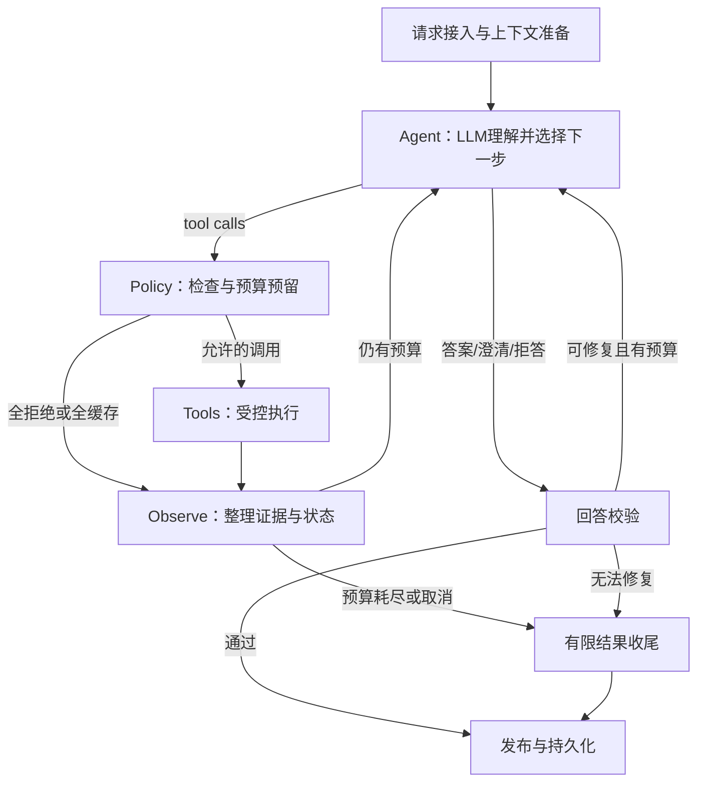

# LimitUpLab Agent：LangChain + LangGraph ReAct 重构计划

- 日期：2026-09-12。
- 代码审查基线：`33f2a54`。
- 状态：待实施的设计与验收计划，不代表新运行时已经上线或通过验收。
- 范围：Tool-Using Chat Agent；保留现有数据服务、评分逻辑、预测记录和投资合规边界。
- 方向：LangChain 模型/工具接口 + LangGraph 自定义 StateGraph + 单一有界 ReAct 循环。
- 文档关系：本方案取代 [原任务运行时设计](agent-task-runtime-redesign.md) 中“预先生成完整 TaskPlan DAG + 独立 PlanPatch/Replan”的后续实施方向；原文保留为历史设计和失败证据。

## 1. 重构背景

### 1.1 当前实现及实际问题

当前 Chat 入口根据 `LIMITUPLAB_AGENT_RUNTIME` 在默认 `legacy` 与显式启用的 `task` 之间切换：

- Legacy：关键词/场景复杂路由；普通请求由 LLM 选择 capability，后端映射工具、归一化参数并执行 Policy 补救；部分场景进入旧 Complex Graph。
- Task：LLM 先生成 requirements 和完整步骤图，包含参数、依赖、绑定路径及条件；执行后由 Completion LLM 判断并提出补充步骤，必要时再调用 Replan LLM，最后生成和修复答案。
- 两套路径的 Query、Policy、回答校验与失败降级行为不完全一致。运行方式改变可能导致同一问题采用不同流程。

已检查的主要问题：

1. 复杂度路由依赖有限场景，新问法容易进入不合适的路径。
2. 完整 DAG 要求模型提前猜测工具结果字段和路径，依赖展开容易失败。
3. Planner、Completion、Replan 与 Answer Repair 叠加，增加模型调用、上下文长度和状态协调成本。
4. 工具输出契约不完整，模型可能要求按不存在的字段排序，或误解时间能力。
5. 工具查询成功不等于任务完成；筛选或排序失败仍可能保留工具 `ok` 状态。
6. 部分路径由 Policy 隐式补工具或重写参数，原始模型决策与实际行为难以区分。
7. 部分回答降级展示原始 JSON，缺少可读的逐项交付。
8. 业务 Partial 主要藏在 trace，HTTP 正常结束会保存成 run success，容易误读质量。

这不是“缺少 LangGraph”的问题。当前已经依赖 `langchain-core`、`langchain-openai`、`langgraph`；需要改变模型与执行层的职责、循环和契约。

### 1.2 证据与判断边界

[代码质量审查记录](code-quality-audit.md) 已记录不同提交上的离线、冻结 Live 与 HTTP 结果。其中正式复杂冻结报告曾达到 18/24 通过、3/3 稳定 4/8，仍未达到发布门槛。最近交互式三个复杂任务也暴露了缺字段、选择错误和答案降级问题。

这些结果来自不同样本和代码时点，不能合并成统一成功率。按用户决定，已有失败证据足以支持重构，取消重构前单独重跑旧运行时基线的阶段，直接进入最小 ReAct 闭环实施。复用已有报告和失败案例；重构后仍须真实验收，不能仅凭图节点或合成测试通过宣称质量改善。新旧结果条件不一致时，分别报告，不能宣称严格 A/B 提升。

## 2. 目标、非目标与设计原则

### 2.1 目标

- LLM 真正负责意图识别、短程规划、工具选择、参数生成、语义观察与下一步决策。
- 简单和复杂问题共享一条循环，按实际证据需求自然结束或继续。
- 新股票、新日期和已有工具的新组合不要求新增 scenario 或问法正则。
- 工具执行有权限、参数、时间、并发、调用数和成本边界。
- 多轮指代准确；历史回答不冒充新鲜市场事实。
- 单项失败不阻断其他已授权研究；空结果、缺数据和错误区别明确。
- 每项关键事实有来源；任务不完整就披露缺口；回答符合研究产品边界。
- 真实质量提升可被同条件 A/B 证明，同时控制简单题延迟和复杂题成本。

### 2.2 非目标

- 不把 Agent 改为只做自然语言到固定查询 DSL 的翻译器。
- 不新增多 Agent、独立 Planner/Critic/Replanner 集群或通用代码执行环境。
- 不改评分算法、Top10 策略或 D+1～D+5 预测表现。
- 不承诺支持现有数据工具以外的能力，不自动增加财报等尚未接入的数据源。
- 不通过放宽评测阈值、修改问题约束或扩大数据日期来制造成功。

### 2.3 职责边界

| 参与方 | 负责 | 不具有的权力 |
|---|---|---|
| LLM Agent | 理解意图、选工具与参数、解释结果、调整查询、生成回答 | 绕过权限、增加预算、伪造事实 |
| Tool Policy | 参数/权限/时点检查、预算预留、等价规范化、缓存复用 | 按问法暗中补工具或放宽用户条件 |
| 工具与计算服务 | 查询、过滤、排序、集合和指标运算 | 把缺失值伪装成零或保证数据不存在 |
| Observe | 整理实际调用、证据、缺失、错误与预算 | 独立决定新闻语义或硬编码下一工具 |
| 回答检查 | 验证可计算约束、证据关系和明确合规要求 | 宣称可以确定性证明所有自然语言语义正确 |

## 3. 重构前后流程对比

### 3.1 重构前

```text
用户请求 → 权限/上下文/注入检查 → runtime 环境开关
  ├─ legacy → 场景规则路由
  │    ├─ 普通路径：LLM capability → 参数归一化 → 执行/Policy补救 → 回答/模板
  │    └─ Complex Graph：场景编排 → 执行/有界恢复 → 回答
  └─ task → LLM完整TaskPlan → DAG执行 → LLM Completion
                 ↑                         ↓
                 └──── 增量步骤/Replan ─────┘
                         → Answer/Repair → 持久化
```

### 3.2 重构后



收尾采用已验证事实的确定性呈现或固定错误说明，必须通过相同的基础合规/输出清洗；不能重入无限修复。若收尾内容仍无法验证，返回最小错误说明。

| 维度 | 重构前 | 重构后 |
|---|---|---|
| 意图与路由 | capability 与关键词复杂路由交织 | 首轮 LLM 识别目标并直接选工具 |
| 规划粒度 | 预先完整 DAG 或固定场景 | 每轮决定当前可执行的一批调用 |
| 观察 | Completion/路径校验混合 | Observe 整理事实，下一轮同一 LLM 作语义决策 |
| Replan | 独立步骤与 patch 协议 | 常规 ReAct 循环中的行动调整 |
| 工具参数 | 多层重写与隐式补救 | 原始参数、规范化参数、拒绝原因全部可审计 |
| 数据传递 | 模型猜绑定 JSON path | 完整输出契约、证据 ID、受控结果集合引用 |
| 失败 | 整图恢复与模板降级 | 每调用隔离、定向修复、保留成功证据 |
| 简单题 | runtime 不同成本不同 | 同一循环，必要时一轮工具后结束 |
| 完成状态 | HTTP success 容易混同任务成功 | execution status 与 task status 分离 |

## 4. 节点与 Agent Loop 详细设计

### 4.1 Prepare：建立可信运行上下文

- 复用 FastAPI owner 校验、会话归属、限流和 usage capture。
- 服务端注入 run_id、owner_id、session_id、profile、固定 anchor_datetime、deadline 和预算；模型不能填写或修改这些字段。
- 静态能力说明和明确产品边界可直接处理；语义含糊的请求交给 LLM，不以宽泛关键词拒答。
- 当前用户明确条件优先于历史继承条件，历史条件优先于页面默认值。
- 自然日、交易日、截至日、事件日和获取时间分开建模；缺历史数据不能改成今天。

### 4.2 Agent：意图识别、短程规划、行动或回答

使用 LangChain 标准消息和原生 tool calling。首轮同时理解目标与选工具，不强制先调用一个 Intent 模型再调用 Planner。

简单题可直接调用业务工具。多交付任务可使用轻量 `update_task` 控制工具登记 requirement ID、目标、明确约束和完成情况；这是工作清单，不是执行 DAG，也不是隐藏思维链。兼容的模型可在同一响应中登记清单并提出首批数据调用。

Agent 每轮可选择：调用工具、更新待办、追问、拒绝不允许部分、提交完整/部分答案。依赖结果的查询等上一批完成后再决定；独立调用可同批提出。

始终对照用户原话：模型生成的 requirements 可能漏项，不能用“自己的清单全勾上”代替原始任务覆盖。任务修改保留来源和版本，不允许为了完成率悄悄撤销用户要求。

### 4.3 Policy：每个调用的统一入口

检查工具注册/profile、参数 Schema、实体消歧、时间能力、结果引用归属、重复调用和预算。允许无歧义转换，例如日期格式和唯一股票代码解析；不能修改窗口、筛选条件、名次区间或来源要求。

Decision 为 `allow / normalize / reuse / reject`，记录 raw_call、actual_call、reason 和调用 ID。拒绝调用也返回配对 ToolMessage，模型据此修正或收尾。Policy 不按问题词语暗中补充调用。

来源要求可表达为“价格声明需要同实体同时间口径的行情证据”，不强制唯一合法工具轨迹。必要证据缺口反馈给 Agent 选择后续查询。

### 4.4 Tools：隔离执行并保留完整结果

采用单一调度入口，Policy 完成预算预留后调用受控 ToolNode/工具包装器。独立调用有限并发，初始建议 3；同批一个失败不让其他调用丢失结果。

每个 tool_call_id 恰有一个回传结果，包括拒绝、缓存、错误和取消。并发任务使用各自数据库连接，不共享不安全连接或任意改写图状态；在汇总边界合并记录。

### 4.5 Observe：确定性整理，LLM 继续决策

输入为实际执行记录，输出为新增证据、实际参数、状态、覆盖、截断、字段缺失、失败实体、来源冲突和剩余预算。完整 payload 存入证据仓库，模型接收有结构的摘要与可展开引用。

Observe 不额外调用 LLM。下一次 Agent 模型调用同时完成“理解观察结果、判断任务缺口、选择下一工具”。工具成功、数据完整和 requirement 完成分别记录；计算/选择失败不能被底层查询成功掩盖。

### 4.6 Answer Gate 与终止

Agent 无需固定再调用一个 Answer 模型，可直接提交带证据引用的答案草稿。检查实体、日期、数字、单位、名单、排序、已知任务覆盖和合规；语义上的充分性仍有模型误判风险，需评测和人工抽查。

可修复错误至多回到 Agent 一次；新增取数也受同一预算限制。不能修复时逐项展示可信事实和缺失原因，不把原始 JSON 作为产品答案。

顶层 `task_status`：`complete / partial / empty / clarify / refuse / error / cancelled`。另存 `stop_reason`，如 budget_exhausted、source_unavailable、validation_failed。有效空查询可正确回答，不自动计为失败。

## 5. 工具与证据契约

现有工具逐个补充输入/输出 Schema、用途与相邻工具区别、单位、主键、历史能力、默认窗口、分页、覆盖率、真实数据截止日和成本。不能通过参数名是否含 date 推断历史支持。

工具统一结果外壳：

```text
call_id / tool_name / requested_arguments / actual_arguments
execution_status: completed | rejected | reused | failed | cancelled
result_state: ok | empty | partial | error（无有效数据结果时可为空）
schema_version / evidence_id / rows_or_facts / sources
requested_scope / actual_scope / data_as_of / retrieved_at
coverage / truncated / data_missing / error_code / retryable
```

关键事实绑定 entity、date/as_of、metric、value、unit、source。服务端产生事实 ID，避免模型猜测深层 JSON path。大名单产生 result_id 或 symbol_set_id，按 owner/session 校验；引用不能跨权限、不能被模型随意伪造。

新增或完善受控计算工具：filter、sort、offset/limit、intersection、difference、distinct、group/aggregate。指标使用已定义口径；LLM 选运算，代码计算。暂不开放任意 SQL/Python；优先现有 Python/数据库实现，不为架构图强行增加 DuckDB 等依赖。

批量工具报告每实体状态。包装器内多次远端请求不能冒充一次廉价调用；来源返回空集合不等于数据源不可用，也不能将空集合转成空 symbol 请求。

## 6. 失败恢复与预算

| 情况 | 策略 |
|---|---|
| 参数类型/枚举错误 | 不执行，返回字段错误，LLM 修正 |
| 股票名称有歧义 | 返回候选，必要时向用户澄清 |
| 超时、429、临时5xx | deadline 内有限重试；尊重 Retry-After，计入预算 |
| 不支持的日期或字段 | 非重试错误；选择真正可用来源或披露能力缺口 |
| empty | 作为有效观察；仅因用户条件或新信息继续查询 |
| partial | 保留成功实体，只恢复失败部分 |
| 返回Schema错误 | 隔离结果，不能作为可信事实 |
| Provider/格式错误 | 统一有限重试/格式恢复，禁止层层重试放大 |
| 无新增信息 | 返回收敛提示，阻止同义重复查询 |
| 取消/总预算耗尽 | 停止新增请求，保存部分结果和终止原因 |

初始上限沿用工具执行预算 8；底层远端请求、重试和批量展开如实计量，真正原生批量请求与多次 fan-out 区分。另设计算工作量、返回行数、并发限制，防止通过控制/计算工具绕过资源边界。

模型请求建议最多 8 次，失败也计数；开始新一轮前保留一次收尾机会；同参数瞬时错误最多重试一次，回答修复最多一次。deadline 和 token 上限在闭环实施中结合现有配置确定并配置化，后续按实测校准，不能写死未经验证的延迟承诺。

缓存按工具、规范化参数、数据版本/时点和权限范围索引。参数略变不自动视为有新信息，需结合已有覆盖避免重复取数。不能仅按工具名去重，也不能把实时结果永久复用。

## 7. 上下文、记忆与状态持久化

### 7.1 三层上下文

| 层 | 内容与寿命 |
|---|---|
| 对话 | 最近问答、用户明确约束、研究目标与未解决追问；按token预算裁剪 |
| 当前运行 | 标准消息、任务清单、调用、错误、预算、草稿；本轮生命周期 |
| 证据 | 完整工具结果、事实ID、集合ID、时点与来源；可追溯、有保留期 |

复用现有 owner-scoped session memory。长期摘要不保存市场数值作为持续有效事实。历史回答可用于指代，历史数据引用必须校验时点和来源；最新问题重新取数。

“这三只”绑定明确集合；“改成前五”只覆盖数量；“再看昨天”改变时间后重新查询；新话题不继承无关股票和日期。多种指代候选时追问，禁止拼接所有历史用户文本后统一抽取条件。

上下文优先当前原话、未完成要求、明确条件、最近观察、关键证据、近期消息，再放旧摘要。工具调用消息与对应 ToolMessage 成组保留；完整名单不依赖有损摘要。

### 7.2 状态及恢复

State 只保留 messages、task、pending_calls、evidence_refs、observations、budget、answer_draft、validation、terminal_status。身份、服务对象、配置与锚点通过可信 Runtime Context 注入。

服务启动时编译图。checkpoint 保存运行状态，聊天表保存用户可见消息，证据仓库保存结果，明确各自唯一写入职责。单机可采用 SQLite checkpointer，多实例再评估 Postgres，不预先增加部署复杂度。

checkpoint 标识绑定 owner 和 run；同会话串行化或拒绝重叠执行。请求幂等、完成消息只保存一次；重连不重新跑工具。恢复不承诺外部请求恰好一次，对已完成记录复用，对不确定调用明确记录。会话删除覆盖关联证据/checkpoint 的清理与保留策略。

## 8. 回答接地、合规与用户体验

- 优先由证据确定性渲染表格和关键数值，LLM 负责解释、比较、相关性与不确定性表达。
- 检查股票数值互换、日期错绑、同值不同指标、单位、复权口径、列表完整性、来源冲突及缺失披露。
- 无法解析的事实声明标记 unverified，不能默认通过；关键未验证事实应补证据、删除或降级表达。语义检查和机器抽取不具有100%覆盖保证。
- 新闻事实与推断分开；相关性不能写成确定因果；评分和人气不能写成未来上涨概率。
- 明确交易指令可提前拒绝；混合请求回答允许的研究部分。历史机构买卖事实不属于给用户的交易建议，不能只按“买入/卖出”词语拒答。
- 输出检查买卖建议、仓位、目标价、收益承诺和确定性预测；免责声明不能挽救正文违规。高风险/含糊输出可采用独立语义审核，其成本、超时和失败也需报告。
- 外部新闻、网页、工具文本均是不可信内容，不能变成系统指令、权限或预算修改。密钥、内部错误栈和用户身份不得进入模型上下文或前端。
- 前端先流式展示业务进度，初期最终答案通过检查后发布；后续若逐段流式，必须先审后发，不能先泄漏违规文本再替换。
- SSE completed 只表示运行结束，携带真实 task_status、缺失项和stop_reason。提供显式取消；断线后允许服务端继续并通过重连读取结果。

## 9. 模块迁移清单

| 当前模块 | 处理 |
|---|---|
| routers/agents.py | 复用认证、限流、SSE；统一调用新服务，区分执行与任务状态 |
| agents/chat.py | 抽离编排；复用经测试的业务辅助与确定性呈现 |
| complex_graph/ | 迁移验收后退役场景路由和专用编排 |
| task_runtime/ | 选择性复用适配/记录；替换完整DAG、路径绑定和独立PlanPatch |
| agents/tools.py、tool_execution、services | 复用数据能力，补契约与批量/计算接口 |
| tool_policy.py | 提取通用审核；退役基于问法的隐式补工具逻辑 |
| query_contract.py | 保留共享业务口径，不承担全局语义路由 |
| capability_contract.py | 保留工具分类、说明、证据约束与评测标签 |
| llm_provider.py | 增加标准消息、多tool_calls、ToolMessage和usage接口；统一重试 |
| session_memory.py、repositories | 复用隔离/摘要；扩展集合引用、预算和证据归属 |
| answer_grounding.py、sanitizer | 接入生产出口，覆盖未验证声明和安全呈现 |
| offline/live评测 | 保留冻结数据，新增ReAct轨迹与完成状态适配 |

建议新实现集中在 `backend/app/agents/react_runtime/`，包含 graph、state、context、policy、tools、observe、answer_gate、prompts。仅为建议文件划分，避免每个概念都创建独立框架。业务服务仍保留原位置。

## 10. 实施步骤与交付门槛

### A. 已取消：不再单独重跑旧运行时基线

已有报告和真实失败案例作为重构依据，不新增旧运行时基线评测，也不以完成全工具盘点作为开工前置条件。保留原阶段编号便于历史讨论引用，实际实施从 B 开始。

模型消息协议在 B 接入时验证；工具参数、输出、时间能力、错误和成本随 B/C 的工具接入逐项检查。这些属于实现正确性检查，不是重新评估旧 Agent 水平。

### B. 最小纵向 ReAct 闭环

1. 接通标准消息模型适配与最小StateGraph，同时验证多轮tool calling、调用ID配对、工具错误回传和usage。
2. 实现共享Policy、逐调用结果、Observe、统一预算和顶层终态。
3. 先接名单、新闻、K线、实体解析及必要计算工具；随接入核实输入输出、时间支持和底层调用成本，覆盖简单、动态名单、条件分支、单项失败。
4. 复用既有失败案例和冻结工具世界，对新闭环运行真实模型验收并保留配置与trace；仅在已有旧报告条件可比时给出对照，不补跑旧运行时作为前置任务。

门槛：四类场景走通真实调用；没有关键词complex路由、独立Replanner或原始JSON答案。若质量未改善，停在此阶段分析，不扩大迁移掩盖问题。

### C. 全工具与多轮接入

1. 随接入建立覆盖表，逐项接通全部既有研究工具；先验证契约再注册。
2. 批量查询、集合引用、排序区间、差集与聚合保持确定性。
3. 接通会话摘要、近期消息、时间口径和指代测试。

门槛：功能覆盖无静默缩水；新增同能力问法不要求新增scenario；多轮改对象/日期/数量不串用条件。

### D. 输出与运行可靠性

1. 接入事实引用、关系校验、投资合规与一次有限修复。
2. 接通用户可读的partial/empty/error回答及前端状态。
3. 实现幂等、同会话并发控制、checkpoint、重连、取消、数据隔离与清理策略。
4. 检查模型/工具多层重试与底层请求计量。

门槛：不合格正文不提前流出；Partial不记作业务Complete；恢复不重复已完成调用；跨用户证据不可访问。

### E. 验收、切换与退役

1. 完成新运行时冻结Live、稳定性、Holdout和真实HTTP/页面业务验收；条件一致的已有旧报告可用于A/B对照，其余仅作为历史参考。
2. 新运行时通过质量与成本门槛后切换默认入口。
3. 迁移期保留单个显式部署开关；单次请求不自动跌回Legacy掩盖新链路失败。
4. 确认无消费者后删除旧路由、PlanPatch、重复Prompt/Policy和不可达前端逻辑。
5. 完成核心链路代码质量审查，记录风险、测试与提交；保留部署回滚能力。

按项目约定分小提交，每次源代码提交修改不超过1000行；只提交相关文件，真实修复记入badCase.md。阶段审查写入code-quality-audit.md；本设计文档本身不表示这些实施步骤已完成。

## 11. 测试、观测与验收

### 11.1 测试分层

- 单元/契约：参数、状态、时间、权限、集合计算、预算、消息配对、去重与错误隔离。
- 冻结集成：固定模型输出验证完整图；明确不代表真实LLM能力。
- 冻结Live：真实LLM + 冻结工具世界，允许多个语义正确的调用路径。
- 真实数据：HTTP/页面验证实际数据源、时点、失败、权限、流式和持久化。
- 回归：复用现有Dev/Holdout制度；人工确认的新Bad Case进入Dev，不修改Holdout来迎合实现。

必测：简单单工具、独立并发、动态集合、名次区间、双日期比较、语义条件分支、失败继续、empty/partial/error、字段缺失、分页截断、数据冲突、多轮改条件、提示注入、正常研究与交易建议边界、数值/日期/指标互换、模型异常、预算耗尽、重连与取消。

### 11.2 指标与发布原则

保留既有七层评测与已批准发布阈值，不用“节点跑通”替代交付。每层支持pass/fail/not_applicable；ReAct的工具顺序不要求与单一金标完全一致，能力指标依据原始模型选择/实际工具分类计算，不能用Policy补救冒充原始能力。

报告：目标覆盖、工具选择/参数、Policy拒绝与规范化、真实执行、关键事实接地、任务终态、回答质量、循环次数、无效补查、缓存命中、重试、Provider失败、全部模型token与p50/p95耗时。原始调用与最终执行分开，产品模型成本和离线Judge成本分开。

发布最低原则：Critical全部通过；安全违规为零；关键事实关系正确；沿用已批准Dev/Holdout、稳定性与成本门槛；简单题不明显退化，复杂题同条件质量改善。任何环境错误、跳过或失败单独报告。

LLM Judge只补充相关性、完整性和表达质量，沿用人工校准要求；不能依靠其自身市场知识判数字。无法机器验证的内容和新失败需人工抽查。

### 11.3 运行观测

每run保存模型/Prompt/工具Schema版本、锚点、用户条件、原始tool calls、Policy决策、实际参数、结果来源、证据引用、预算变化、回答校验和终态。记录简短行动原因，不记录隐藏思维链。

管理界面按执行成功与任务完成分开展示；公开答案使用业务名称和真实来源，不把远端证据统一改写成“本地数据”。日志脱敏、证据隔离、外部Trace导出开关与保留期一并明确。

## 12. 官方框架参考

- [LangChain Agents](https://docs.langchain.com/oss/python/langchain/agents)：标准模型—工具循环；create_agent本身构建LangGraph运行时。本项目自定义图，不再嵌套第二个Agent循环。
- [LangChain Tools](https://docs.langchain.com/oss/python/langchain/tools)：工具Schema、ToolNode和运行时上下文。
- [LangChain Runtime](https://docs.langchain.com/oss/python/langchain/runtime)：不可变context、state、store与依赖注入。
- [Short-term memory](https://docs.langchain.com/oss/python/langchain/short-term-memory)：短期状态、checkpointer与摘要。
- [LangGraph Graph API](https://docs.langchain.com/oss/python/langgraph/graph-api)：状态、边和递归保护；业务预算须另行实现。

上述接口应以实施时锁定依赖的兼容测试为准。框架提供执行基础，效果仍取决于模型能力、工具契约、上下文、数据质量和真实验收。
